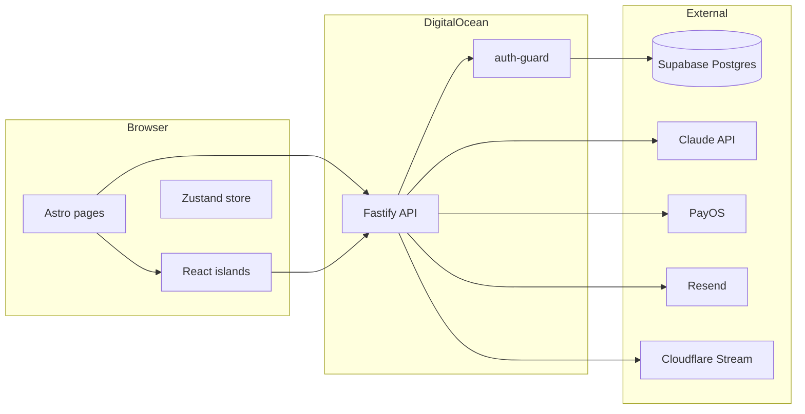

# FitWell MVP — Full Build Plan (+ Audit Integration)

> **Last updated:** March 2026. The March 2026 full-stack audit identified critical runtime bugs in the current implementation. A **Bug Fix Sprint** (Sprint A) is inserted before the phase roadmap to unblock the app. Audit findings are annotated inline throughout each phase using **[Audit]** tags.

---

## Current state

- **In repo:** `api/` (Fastify), `web/` (Astro + React), `supabase/migrations/` (9 migrations), `web/src/design-system.tsx`, `supabase/seed.sql`, `env.example`, `.cursor/mcp.json`, `amendments-log.md`, and full docs: `docs/FitWell_TechSpec_v1_5_2.md`, `docs/screen spec/` (14 screen specs), `docs/FitWell_LoFi_Wireframe_Flow_v1_5.jsx`, `docs/FitWell_Emotional_Design_System_v1_2.jsx`.
- **Implemented:** Anonymous auth, onboarding intake flow, condition/protocol/session/checkin/progress API routes, S01–S17 screens, S30 notification setup, exercise player, S10 post-exercise, design system, check-in form.
- **Broken (see Sprint A):** `GET /api/v1/conditions` crashes in production; every frontend data-fetch returns `undefined`; AI responses are hardcoded; auth upgrade path is absent; billing is a stub.

Tech spec defines **two apps** in one repo: **fitwell-api** (Fastify) and **fitwell-web** (Astro). Phases P0–P6 are in `docs/FitWell_TechSpec_v1_5_2.md` (Part 11). **Tier 1 = full MVP:** symptom intake, protocol assignment, daily check-in, progress, exercise player, paywall/billing (PayOS), 7-day trial, Google OAuth + email/password, pattern detection, proactive nudges, re-engagement, add-condition.

---

## Architecture (from spec)




**Screen flow (simplified):** S01 Splash → S02 Pain Entry → S03 Hook / S03b Path Chooser → S04–S06 onboarding → S04A condition search / S04C confirm → S07–S08 First insight → S09–S10 Exercise player → S12–S13 Check-in (+ S30 notification) → S14–S17 Home / History / Progress. MSK forks: SMSK03 (check-in bifurcation), SMSK07 (assessment), SMSK08 (safety warning).

---

## Front-end development: design-system, wireframe, emotional design

All UI must follow `**web/src/design-system.tsx`** as the single source for components and tokens. No raw hex, no raw pixels, no one-off components that duplicate design-system exports.

### Design system

- **Tokens:** `colors`, `typography`, `spacing`, `radius`, `animation`, `touchTarget` — use these only; no Tailwind arbitrary values for spacing/color.
- **Components:** Section 12 "Component → Screen Registry" maps every screen-spec reference to an export. Before building any screen, resolve each spec "Components" row to a design-system export; do not create new components that already exist.
- **Protocol blocks:** Implement with `<ProtocolBlock variant="fear|insight|protocol|dry|honest|warmth|zero-guilt|peer-nod|pattern">` only.

### LoFi wireframe (`docs/FitWell_LoFi_Wireframe_Flow_v1_5.jsx`)

- Use the `PHASES` and `SCREENS` structure as the canonical order and set of screens. Each `SCREENS[id].render()` is a lo-fi layout reference.
- LoFi primitives → design-system: CP (rule) → `ProtocolBlock`; CpBtn (fill) → `PrimaryButton`; Chip → `PillButton`; ProgressBar (step) → `StepProgressBar`; DotGrid → `ConsistencyDotGrid`; Box → `SkeletonBlock`.

### Emotional Design System

- **Voice:** 4-layer contract (I see you, I understand, I won't waste your time, I won't lie). No motivational fluff, no exclamation encouragement.
- **Copy:** Enforce `.cursor/rules/copy-rules.mdc` and EDS "Rewrites" in every screen.
- **Global CSS (inject once):** Fonts (Be Vietnam Pro, Figtree, DM Mono) and keyframes: `fadeUp`, `typingDot`, `progIn`, `pulse`, `slideIn`.

### Per-screen implementation workflow

1. Open **LoFi wireframe** `SCREENS[screenId]` for layout.
2. Open **screen spec** for Components, Data Variables, Copy Slots, States, Navigation.
3. Map every component to **design-system** (Section 12); import from `@/design-system` only.
4. Apply **Emotional Design** tone and copy-rules.
5. Add global keyframes/fonts in root layout if not already present.

---

## Sprint A — Bug Fix (DO FIRST — app is broken without these)

> These bugs exist in the current codebase and must be fixed before any new development. All are regressions that make the running app non-functional.


| ID      | Area     | File(s)                                                                                        | Bug                                                                                                                                                                                  | Fix                                                                                                                                                                               |
| ------- | -------- | ---------------------------------------------------------------------------------------------- | ------------------------------------------------------------------------------------------------------------------------------------------------------------------------------------ | --------------------------------------------------------------------------------------------------------------------------------------------------------------------------------- |
| **C1**  | API      | `api/src/modules/conditions/conditions.routes.ts:13`                                           | `SELECT c.assessment_required` — column does not exist on `conditions` (only on `msk_conditions`). Every screen gets Postgres 500.                                                   | Change `c.assessment_required` → `m.assessment_required` in the JOIN query.                                                                                                       |
| **C2**  | Frontend | `S14Home.tsx`, `CheckInForm.tsx`, `S10PostExercise.tsx`, `ProgressView.tsx`, `HistoryView.tsx` | `d?.success?.data` is always `undefined`. `d.success` is the boolean `true`; `true?.data === undefined`. Home/Progress/History render empty permanently.                             | Replace all `d?.success?.data` → `d?.success && d?.data`. Specific lines: S14Home 59,77,85,86,98,107,166; CheckInForm 74; S10PostExercise 32–33; ProgressView 45; HistoryView 37. |
| **H2**  | Auth     | `web/src/lib/store.ts`, `web/src/lib/auth.ts`                                                  | `getAuthHeader()` reads `window.__fw_access_token`. Zustand `setAccessToken` writes to store state only — never sets `window.__fw_access_token`. Freshly issued JWTs are never used. | In `setAccessToken`, also do `(window as any).__fw_access_token = token`.                                                                                                         |
| **H7**  | Frontend | `web/src/components/checkin/CheckInForm.tsx:132`                                               | `startExercise()` hardcodes `Authorization: Anonymous ${anonId}`, bypassing `getAuthHeader()`. JWT users create anonymous-scoped sessions.                                           | Use `getAuthHeader()` and guard `if (!auth) return`.                                                                                                                              |
| **H10** | Frontend | `web/src/components/onboarding/ConditionSelect.tsx:53`                                         | Symptom-map always called with hardcoded `'đau lưng'`; user's actual `?q=` input is ignored.                                                                                         | Read `new URLSearchParams(window.location.search).get('q')` and pass as `symptom_text`.                                                                                           |
| **L2**  | API      | `api/src/shared/auth.config.ts`                                                                | `refreshTokenTTL: '30d'` — spec says 7d.                                                                                                                                             | Change to `'7d'` and `maxAge: 7 * 24 * 60 * 60`.                                                                                                                                  |
| **L3**  | API      | `api/src/modules/onboarding/onboarding.routes.ts:22`                                           | Dead ternary: `typeof slug === 'string' ? slug : slug`.                                                                                                                              | Remove ternary; use `slug` directly.                                                                                                                                              |


**Gate:** `GET /api/v1/conditions` returns 200; Home screen renders real data; ConditionSelect passes real query.

---

## Sprint B — Auth Completion

> Auth is the single largest unimplemented vertical. None of the P5 conversion features can work without it.


| ID     | Area      | File(s)                                 | Bug / Gap                                                                                                            | Fix                                                                                     |
| ------ | --------- | --------------------------------------- | -------------------------------------------------------------------------------------------------------------------- | --------------------------------------------------------------------------------------- |
| **H1** | API       | `auth.routes.ts`                        | No `POST /api/v1/auth/refresh` endpoint. Access tokens expire after 15 min with no recovery path.                    | Add refresh route that reads `httpOnly` refresh cookie and returns a new access token.  |
| **H3** | API       | `auth.routes.ts`                        | Only anonymous init exists. No email/password login or registration. `users.email`, `password_hash` are unreachable. | Add `POST /api/v1/auth/register` and `POST /api/v1/auth/login`.                         |
| **H4** | API + Web | `auth.routes.ts`, `web/src/lib/auth.ts` | `users.claimed_at` never written. Anonymous users can never log in from another device.                              | Add `POST /api/v1/auth/claim` (email+password, links anonymous user, returns JWT pair). |
| **L5** | Frontend  | `web/src/pages/login.astro`             | Static placeholder: "Màn hình đăng nhập sẽ có trong P5."                                                             | Wire up login React component once H3/H4 routes exist.                                  |


**Gate:** User can register, login, refresh token silently, claim anonymous data from a new device.

---

## Phase 0 — Foundation ✅ (largely done; verify)

**Goal:** `npm run dev` runs; anonymous session end-to-end; DB schema exists.


| #   | Task                                                                       | Status |
| --- | -------------------------------------------------------------------------- | ------ |
| 0.1 | Repo structure (`api/`, `web/`, workspaces)                                | ✅ Done |
| 0.2 | DB migrations (9 migrations in `supabase/migrations/`)                     | ✅ Done |
| 0.3 | API skeleton (Fastify, CORS, health, shared middleware)                    | ✅ Done |
| 0.4 | Anonymous auth (`POST /auth/anonymous/init`, `Anonymous <id>` guard)       | ✅ Done |
| 0.5 | Web skeleton (Astro + React, Tailwind, Zustand, `lib/auth.ts`, global CSS) | ✅ Done |
| 0.6 | VAPID keys + `push_subscriptions` table + `GET /config/push-key`           | ✅ Done |


**[Audit]** Sprint A bugs must be fixed before P0 gate passes. Sprint B (auth) is a gap from the original P0 scope.

**Gate:** `npm run dev` (web + API) runs; anonymous init returns ID; health returns 200. ✅

---

## Phase 1 — Core loop ✅ (partially done; critical gaps remain)

**Goal:** First user completes Day 1 exercise; assessment fork and safety warning work; rule-based protocol only.


| #    | Task                                                                           | Status                      |
| ---- | ------------------------------------------------------------------------------ | --------------------------- |
| 1.1  | S01 Splash                                                                     | ✅ Done (JWT redirect added) |
| 1.2  | S02 Pain Entry                                                                 | ✅ Done                      |
| 1.3  | S03 Hook + S03b Path Chooser                                                   | ✅ Done                      |
| 1.4  | S04–S06 onboarding (S04A, S04C)                                                | ✅ Done                      |
| 1.5  | Onboarding API (`POST /onboarding/intake`, condition factory, protocol create) | ✅ Done                      |
| 1.6  | Assessment fork (SMSK07)                                                       | ⚠️ Partial — see H8         |
| 1.7  | Safety warnings (SMSK08)                                                       | ⚠️ Partial — see H9         |
| 1.8  | S07–S08 First insight                                                          | ⚠️ Partial — see M4         |
| 1.9  | S09–S10 Exercise player (steps, timer, session start/complete)                 | ✅ Done                      |
| 1.10 | Sessions API                                                                   | ✅ Done                      |


**[Audit] Gaps still open in P1:**


| ID      | Gap                                                                                                                                       | Fix                                                                                                               |
| ------- | ----------------------------------------------------------------------------------------------------------------------------------------- | ----------------------------------------------------------------------------------------------------------------- |
| **H8**  | `SMSK07Assessment.tsx` hardcodes `assessment_test_slug = 'prone_press_up'` for all conditions. Rotator cuff and sciatica get wrong tests. | Remove override; use `assessment_test_slug` from the API response.                                                |
| **H9**  | `OnboardingDescribe.tsx` and `ConditionSelect.tsx` skip assessment+safety-warning flow, navigating directly to `/exercise`.               | After intake, check `assessment_required`; redirect to `/onboarding/assessment` when true.                        |
| **M4**  | S07/S08 copy is lumbar-specific ("ngồi 8 tiếng"). Clinically incorrect for frozen shoulder, plantar fasciitis, tendinopathy.              | Lookup map keyed on `msk_condition_id`; render condition-appropriate copy.                                        |
| **M8**  | No `GET/PATCH /api/v1/conditions/:id` — multi-condition updates have no backend.                                                          | Add both routes.                                                                                                  |
| **H11** | No trial subscription row created during onboarding. Paywall gate has no data to read.                                                    | Create `subscriptions` row (`status: 'trial'`, 7-day expiry) in `condition-factory.createConditionWithPhaseGate`. |


**Gate:** User can go S01 → … → S10 and complete D1 exercise; assessment fork and safety warning work per spec.

---

## Phase 2 — AI layer (Week 5–6)

**Goal:** Claude integration; Pain 5 branch; typing indicator; frozen shoulder Phase 1 no-stretch filter.


| #   | Task                                                                      | Status                              |
| --- | ------------------------------------------------------------------------- | ----------------------------------- |
| 2.1 | Claude integration (protocol.service, ai-provider, FITWELL_SYSTEM_PROMPT) | ❌ Not done                          |
| 2.2 | Context builder `buildAIContext()` (condition, phase, pain history)       | ❌ Not done (file exists, not wired) |
| 2.3 | Pain 5 branch (no protocol; acknowledge + rest + red flag copy)           | ⚠️ Hardcoded template only          |
| 2.4 | Typing indicator (800ms min display)                                      | ✅ Done in CheckInForm               |
| 2.5 | Frozen shoulder filter B4 (`filterProhibitedExercises()`)                 | ❌ Not done                          |
| 2.6 | Lifestyle trigger (store/detect `trigger_event`)                          | ❌ Not done                          |


**[Audit] Gaps from audit:**


| ID     | Gap                                                                                                     | Fix                                                                                    |
| ------ | ------------------------------------------------------------------------------------------------------- | -------------------------------------------------------------------------------------- |
| **H5** | `POST /onboarding/symptom-map` ignores `symptom_text`. Returns hardcoded top-5 with `confidence: 0.7`.  | Implement keyword→slug mapping (P2 start); upgrade to Claude Haiku call (P2 end).      |
| **H6** | Check-in route has hardcoded JSON templates; `context-builder.ts` and `system-prompt.ts` are dead code. | Import context builder; call Claude Haiku from checkin route; return real AI response. |


**Gate:** AI response P95 < 1.5s; Pain 5 verified; frozen shoulder Phase 1 gets no stretch exercises; symptom-map uses real NLP.

---

## Phase 3 — Daily loop (Week 7–8)

**Goal:** Check-in flow; in-app banner; web push and S30; progress tab; email retention.


| #   | Task                                                                    | Status                                  |
| --- | ----------------------------------------------------------------------- | --------------------------------------- |
| 3.1 | S12–S13 Check-in (pain score, freetext, AI response)                    | ✅ Done (AI was hardcoded — fixed in P2) |
| 3.2 | Check-in API (`POST /checkins`, CHECKIN_ALREADY_EXISTS, AI)             | ✅ Done (AI stub — fixed in P2)          |
| 3.3 | InAppBanner (client:load, `GET /notifications/pending`)                 | ✅ Done                                  |
| 3.4 | S30 push permission (one-shot, no retry on deny)                        | ✅ Partial — see M6                      |
| 3.5 | Progress tab S14–S17 (Home, History, Progress, pain chart, consistency) | ✅ Done (data access fixed in Sprint A)  |
| 3.6 | Email retention (Resend D+2, D+4, D+7)                                  | ❌ Not done                              |


**[Audit] Gaps from audit:**


| ID      | Gap                                                                                                                                | Fix                                                                                                                                                                                |
| ------- | ---------------------------------------------------------------------------------------------------------------------------------- | ---------------------------------------------------------------------------------------------------------------------------------------------------------------------------------- |
| **M6**  | Push subscription: `pushManager.subscribe()` never called; no POST to `/push-subscriptions`; `sw.js` has no `push` event listener. | (1) After grant, call `pushManager.subscribe({...vapidKey})`; (2) POST subscription JSON to new `POST /api/v1/push-subscriptions` route; (3) Add `push` event listener in `sw.js`. |
| **M10** | "Làm bài" button clickable even when `sessionDoneToday === true`. Creates duplicate sessions.                                      | Add disabled state or confirm dialog when `sessionDoneToday`.                                                                                                                      |
| **M11** | S14 Home loads data for `conditions[0]` only. Multi-condition users see only first condition.                                      | Add condition tab/selector; load data per selected condition.                                                                                                                      |
| **L6**  | `notification_logs` may reference `/history/day/:date` deep-link; no such page exists.                                             | Add `web/src/pages/history/[date].astro`.                                                                                                                                          |
| **L7**  | `trigger_event` in checkin accepts any string; no enum validation.                                                                 | Add enum validation: `['morning', 'midday', 'pre_sleep', 'post_exercise', 'manual']`.                                                                                              |


**Gate:** Web push subscribe E2E on Chrome Android; iOS in-app banner on focus; email D+2 sent.

---

## Phase 4 — Progress and pattern (Week 9–10)

**Goal:** Pain chart, consistency, Day 7 summary; pattern cron; phase gate evaluator; morning critical 06:55.


| #   | Task                                    | Status              |
| --- | --------------------------------------- | ------------------- |
| 4.1 | Pain chart + consistency (S14–S17)      | ✅ Done              |
| 4.2 | Phase gate evaluator                    | ❌ Not done — see M5 |
| 4.3 | Pattern detection cron                  | ❌ Not done — see M7 |
| 4.4 | Morning critical 06:55 notification     | ❌ Not done          |
| 4.5 | SMSK05 multi-condition schedule builder | ❌ Not done          |


**[Audit] Gaps from audit:**


| ID     | Gap                                                                                                          | Fix                                                                                                                     |
| ------ | ------------------------------------------------------------------------------------------------------------ | ----------------------------------------------------------------------------------------------------------------------- |
| **M5** | Phase gate is always `false` (hardcoded). `phase_progress.unlock_criteria` is never evaluated.               | Add evaluation on session complete: read criteria, check counts, update `conditions.phase_current` when met.            |
| **M7** | `pattern_observations` table is never written to from real check-in data. Pattern cards only show seed data. | Background job (3am VN): analyze last 14 days of check-ins per condition; insert observation row when pattern detected. |
| **M9** | No Fastify `schema:` validation on any route. Malformed payloads hit runtime code.                           | Add JSON schema validation to all mutation routes.                                                                      |


**Gate:** Phase unlock correct; pattern suggestion D14+; morning critical 06:55 fires.

---

## Phase 5 — Conversion (Week 10–12) — Tier 1

**Goal:** Paywall at Day 7; sign-up (Google OAuth + email/password); PayOS two-path; add-condition; subscription state; re-engagement flow.


| #   | Task                                                 | Status                                                     |
| --- | ---------------------------------------------------- | ---------------------------------------------------------- |
| 5.1 | Paywall D7 (block protocol/check-in after trial)     | ❌ Not done (no subscription row created — fixed in P1 H11) |
| 5.2 | Google OAuth + email/password                        | ❌ Not done (Sprint B prerequisite)                         |
| 5.3 | PayOS desktop path (QR + poll + webhook)             | ❌ 501 stub                                                 |
| 5.4 | PayOS mobile path (redirect + return + webhook)      | ❌ 501 stub                                                 |
| 5.5 | OI-2: PayOS expired link retry flow                  | ❌ Not done                                                 |
| 5.6 | S19b + S29 (post-paywall flow, add-condition modal)  | ❌ Not done                                                 |
| 5.7 | Re-engagement (zero-guilt copy, reentry after churn) | ✅ Partial (S15 reengagement card implemented)              |


**[Audit] Gaps from audit:**


| ID      | Gap                                                                                                            | Fix                                                                                                                                                              |
| ------- | -------------------------------------------------------------------------------------------------------------- | ---------------------------------------------------------------------------------------------------------------------------------------------------------------- |
| **H11** | All billing routes return 501. No `subscriptions` row created on onboarding — paywall gate cannot be enforced. | (1) Create trial row in `condition-factory`; (2) implement PayOS `create-order` + `payos-webhook`; (3) add paywall middleware that reads `subscriptions.status`. |
| **L5**  | `/paywall` page is static placeholder HTML.                                                                    | Wire up paywall React component once H11 billing is done.                                                                                                        |


**Front-end:** S19, S19b, S26, S27, S20, S29: build from LoFi wireframe + screen specs using design-system only. Paywall and re-engagement copy per Emotional Design and copy-rules.

**Gate:** Desktop QR poll and mobile redirect both confirm payment E2E; Google OAuth claims anonymous data; subscription state gates access correctly.

---

## Phase 6 — Launch prep (Week 12–14)

**Goal:** PostHog, Sentry, deploy, VAPID prod, OI-4 audit, perf, health.


| #   | Task                                                                                          | Status     |
| --- | --------------------------------------------------------------------------------------------- | ---------- |
| 6.1 | PostHog (funnel events: onboarding → check-in → paywall → conversion)                         | ❌ Not done |
| 6.2 | Sentry (server-side DSN, error reporting)                                                     | ❌ Not done |
| 6.3 | Deploy (Vercel web, DigitalOcean API, custom domain, env vars)                                | ❌ Not done |
| 6.4 | VAPID production keys (no regeneration after launch)                                          | ❌ Not done |
| 6.5 | OI-4 audit (`supabase/seed.sql` — every exercise row has ≥1 movement type in `clinical_tags`) | ❌ Not done |
| 6.6 | Perf + health (P95 API < 500ms; `GET /health` → 200)                                          | ❌ Not done |


**[Audit] Additional launch blockers:**


| ID     | Gap                                                                                                                                                                                                                        | Fix                                                                                                                      |
| ------ | -------------------------------------------------------------------------------------------------------------------------------------------------------------------------------------------------------------------------- | ------------------------------------------------------------------------------------------------------------------------ |
| **M1** | `user_profiles.user_id` missing UNIQUE constraint — duplicate profiles possible under concurrent requests.                                                                                                                 | New migration: `ALTER TABLE user_profiles ADD CONSTRAINT user_profiles_user_id_unique UNIQUE (user_id);`                 |
| **M2** | Missing indexes on `conditions(user_id)`, `conditions(msk_condition_id)`, `protocols(user_id)`, `sessions(protocol_id)`, `user_profiles(user_id)`, `pattern_observations(condition_id)`, `subscriptions(user_id, status)`. | New migration with all `CREATE INDEX IF NOT EXISTS` statements.                                                          |
| **M3** | `video_url` is fetched and stored in `ExercisePlayer` but never rendered — no `<video>` or Cloudflare Stream embed.                                                                                                        | When `exercise.video_url` set, render `<iframe src="https://iframe.cloudflarestream.com/{id}">` at 38% viewport height.  |
| **L1** | Rate-limit middleware is `await reply;` — a no-op that provides zero protection.                                                                                                                                           | Implement in-memory rate limiting with `@fastify/rate-limit` (login: 10/15min; register: 5/1h).                          |
| **L4** | `red_flag_patterns` and `lifestyle_events` tables unused in production — no code reads or writes them.                                                                                                                     | Implement red-flag detection post-check-in (read `red_flag_patterns`); store lifestyle events from S05 trigger question. |


---

## Database — Pending migrations

Two new migrations needed before launch (from audit):

### `20260316000010_user_profiles_unique.sql`

```sql
-- Prevent duplicate user_profiles rows under concurrent onboarding
ALTER TABLE user_profiles
  ADD CONSTRAINT user_profiles_user_id_unique UNIQUE (user_id);
```

### `20260316000011_indexes.sql`

```sql
CREATE INDEX IF NOT EXISTS idx_conditions_user_id     ON conditions(user_id);
CREATE INDEX IF NOT EXISTS idx_conditions_msk         ON conditions(msk_condition_id);
CREATE INDEX IF NOT EXISTS idx_protocols_user_id      ON protocols(user_id);
CREATE INDEX IF NOT EXISTS idx_sessions_protocol      ON sessions(protocol_id);
CREATE INDEX IF NOT EXISTS idx_user_profiles_user     ON user_profiles(user_id);
CREATE INDEX IF NOT EXISTS idx_pattern_obs_condition  ON pattern_observations(condition_id);
CREATE INDEX IF NOT EXISTS idx_subscriptions_user     ON subscriptions(user_id, status);
```

---

## Cross-cutting

- **Front-end:** Every screen implemented from LoFi wireframe layout + screen spec (Components, Data, Copy, States, Navigation) using **design-system** components and tokens only; copy from Emotional Design and copy-rules. See workflow above.
- **Copy:** All UI Vietnamese; follow `.cursor/rules/copy-rules.mdc` and screen spec copy slots.
- **Design:** Use `web/src/design-system.tsx` only; no raw hex/pixels; touch targets and tokens per `.cursor/rules/design-system.mdc`.
- **Testing:** Before each screen commit, run smoke check per `.cursor/rules/testing.mdc`; log deviations in `amendments-log.md`.
- **API contract:** Follow `FitWell_TechSpec_v1_5_2.md` Part 4 and Section 1.4 (error codes, `{ success, data }` envelope). Access pattern: `if (d?.success && d?.data)` — never `d?.success?.data`.

---

## Consolidated sprint order


| Sprint              | Items                         | Outcome                                                                      |
| ------------------- | ----------------------------- | ---------------------------------------------------------------------------- |
| **A — Bug Fixes**   | C1, C2, H2, H7, H10, L2, L3   | App renders real data; auth header works; symptom query passes through       |
| **B — Auth**        | H1, H3, H4 + H2               | Login, register, JWT refresh, anonymous claim                                |
| **P1 gaps**         | H8, H9, H11, M4, M8           | Correct assessment flow; trial subscription created; condition-specific copy |
| **P2 — AI**         | H5, H6, 2.1–2.6               | Real Claude Haiku for check-in + symptom-map; context builder wired          |
| **P3 — Daily loop** | M6, M10, M11, L6, L7, 3.3–3.6 | Push E2E; email retention; multi-condition home                              |
| **P4 — Progress**   | M5, M7, M9, 4.2–4.5           | Phase advancement; pattern cron; route validation                            |
| **P5 — Conversion** | H11 (PayOS), L5, 5.1–5.7      | PayOS E2E; paywall enforced; add-condition                                   |
| **P6 — Launch**     | M1, M2, M3, L1, L4, 6.1–6.6   | DB hardened; video player; rate limiting; PostHog/Sentry; deploy             |


---

## Open decisions

- **Monorepo vs two repos:** Single repo with `api/` and `web/` is current approach — recommended to keep.
- **Red-flag detection:** `red_flag_patterns` table exists with seed data. Decision needed: run synchronously post-check-in (add latency) or async via queue. Recommendation: async job triggered by check-in webhook, writes to `notification_logs`.
- **Lifestyle events (S05 trigger):** `lifestyle_events` table exists. Decision needed: capture in check-in POST or separate route. Recommendation: add `trigger_event` field to check-in body (validation enum per L7).

