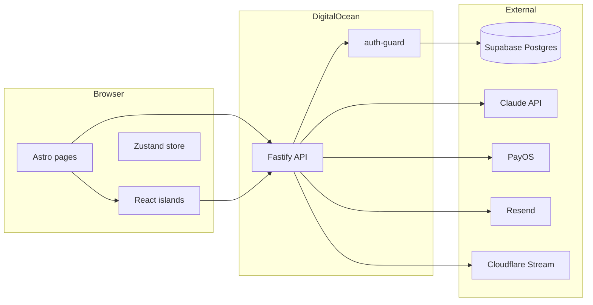

# FitWell MVP — Full Build Plan (+ Audit Integration)

> **Last updated:** March 2026 — Phase 5 Conversion (paywall, PayOS, billing routes) implemented.
> Sprint A, Phase 1, Phase 1 R2-Audit, Phase 2 gaps, and **Phase 5 paywall/billing (R-C1, R-C2, R-L3, L5, 5.1, 5.3, 5.4)** are **complete**. Round 3 audit findings (A1–A10) are annotated below.

---

## Current state

- **In repo:** `api/` (Fastify), `web/` (Astro + React), `supabase/migrations/` (**11 migrations:** 01–09, 11, 12; **pending:** 10 user_profiles_unique, 13 indexes), `web/src/design-system.tsx`, `supabase/seed.sql`, `env.example`, `.cursor/mcp.json`, `amendments-log.md`, and full docs: `docs/FitWell_TechSpec_v1_5_2.md`, `docs/screen spec/` (14 screen specs), `docs/FitWell_LoFi_Wireframe_Flow_v1_5.jsx`, `docs/FitWell_Emotional_Design_System_v1_2.jsx`.
- **Implemented:** Anonymous auth, onboarding intake flow, condition/protocol/session/checkin/progress API routes, S01–S17 screens, S30 notification setup, exercise player, S10 post-exercise, design system, check-in form; **Phase 5:** subscription service, PayOS create-order/payment-status/webhook, paywall gate (402 on sessions/protocols/checkins), paywall page (PaywallView: plans, QR + poll desktop, redirect + poll mobile).
- **Sprint A complete ✅:** `GET /api/v1/conditions` fixed; `d?.success?.data` → `d?.success && d?.data` across all components; `startExercise` uses `getAuthHeader()`; refreshTokenTTL corrected to 7d.
- **Phase 1 gaps complete ✅:** Assessment fork uses real `assessment_test_slug`; onboarding routes through assessment/insight; trial subscription row created; condition-specific insight copy; `GET/PATCH /api/v1/conditions/:id` added.
- **Phase 1 R2-Audit complete ✅:** Multi-exercise player; dead `completed` state removed; assessment result filters by `clinical_tags`; condition-factory 422 when no exercises; UNIQUE (user_id, msk_condition_id) + ON CONFLICT; `show_safety_warning` persisted and PATCH ack; S03b design tokens; timer deps fixed; `CONFIRM_SLUGS_KEY` in `lib/session-keys.ts`.
- **Phase 2 gaps complete ✅:** symptom-map keyword matching (name_vi, body_region, insight_hook_vi); symptom_text string validation; buildAIContext wired in checkin with personalized copy; ai_response.protocol populated from first exercise; exercise_card.location from DB; trigger_event enum validation (L7).
- **No critical broken items.** Push pipeline fixed in P3 (R-C4). PayOS/billing fixed in P5 (create-order, payment-status, webhook, paywall gate 402, PaywallView). Remaining gaps: Sprint B auth (H1, H3, H4), P5.5/P5.6 (expired-link retry, S19b/S29 add-condition), P3.6 email retention, P6 launch items.

Tech spec defines **two apps** in one repo: **fitwell-api** (Fastify) and **fitwell-web** (Astro). Phases P0–P6 are in `docs/FitWell_TechSpec_v1_5_2.md` (Part 11). **Tier 1 = full MVP:** symptom intake, protocol assignment, daily check-in, progress, exercise player, paywall/billing (PayOS), 7-day trial, Google OAuth + email/password, pattern detection, proactive nudges, re-engagement, add-condition.

---

## Architecture (from spec)



**Screen flow (simplified):** S01 Splash → S02 Pain Entry → S03 Hook / S03b Path Chooser → S04–S06 onboarding → S04A condition search / S04C confirm → S07–S08 First insight → S09–S10 Exercise player → S12–S13 Check-in (+ S30 notification) → S14–S17 Home / History / Progress. MSK forks: SMSK03 (check-in bifurcation), SMSK07 (assessment), SMSK08 (safety warning).

---

## Front-end development: design-system, wireframe, emotional design

All UI must follow `**web/src/design-system.tsx`** as the single source for components and tokens. No raw hex, no raw pixels, no one-off components that duplicate design-system exports.

### Design system

- **Tokens:** `colors`, `typography`, `spacing`, `radius`, `animation`, `touchTarget` — use these only; no Tailwind arbitrary values for spacing/color.
- **Components:** Section 12 "Component → Screen Registry" maps every screen-spec reference to an export. Before building any screen, resolve each spec "Components" row to a design-system export; do not create new components that already exist.
- **Protocol blocks:** Implement with `<ProtocolBlock variant="fear|insight|protocol|dry|honest|warmth|zero-guilt|peer-nod|pattern">` only.

### LoFi wireframe (`docs/FitWell_LoFi_Wireframe_Flow_v1_5.jsx`)

- Use the `PHASES` and `SCREENS` structure as the canonical order and set of screens. Each `SCREENS[id].render()` is a lo-fi layout reference.
- LoFi primitives → design-system: CP (rule) → `ProtocolBlock`; CpBtn (fill) → `PrimaryButton`; Chip → `PillButton`; ProgressBar (step) → `StepProgressBar`; DotGrid → `ConsistencyDotGrid`; Box → `SkeletonBlock`.

### Emotional Design System

- **Voice:** 4-layer contract (I see you, I understand, I won't waste your time, I won't lie). No motivational fluff, no exclamation encouragement.
- **Copy:** Enforce `.cursor/rules/copy-rules.mdc` and EDS "Rewrites" in every screen.
- **Global CSS (inject once):** Fonts (Be Vietnam Pro, Figtree, DM Mono) and keyframes: `fadeUp`, `typingDot`, `progIn`, `pulse`, `slideIn`.

### Per-screen implementation workflow

1. Open **LoFi wireframe** `SCREENS[screenId]` for layout.
2. Open **screen spec** for Components, Data Variables, Copy Slots, States, Navigation.
3. Map every component to **design-system** (Section 12); import from `@/design-system` only.
4. Apply **Emotional Design** tone and copy-rules.
5. Add global keyframes/fonts in root layout if not already present.

---

## Sprint A — Bug Fix ✅ COMPLETE

> All critical runtime bugs fixed. App now renders real data.

| ID | Area | File(s) | Bug | Status |
| --- | --- | --- | --- | --- |
| **C1** | API | `conditions.routes.ts` | `SELECT c.assessment_required` — column on `msk_conditions` not `conditions`. Every screen got Postgres 500. | ✅ Fixed — reads `m.assessment_required`, `m.assessment_test_slug`, `m.msk_slug` |
| **C2** | Frontend | 10+ components | `d?.success?.data` always `undefined` (`true?.data === undefined`). Home/Progress/History blank. | ✅ Fixed — `d?.success && d?.data` across all components |
| **H7** | Frontend | `CheckInForm.tsx:132` | `startExercise()` hardcoded `Anonymous` auth header, bypassing JWT. | ✅ Fixed — uses `getAuthHeader()` |
| **H10** | Frontend | `ConditionSelect.tsx:53` | Symptom-map always sent `'đau lưng'`; user's `?q=` ignored. | ✅ Fixed — reads real `?q=` param |
| **L2** | API | `auth.config.ts` | `refreshTokenTTL: '30d'` — spec says 7d. | ✅ Fixed — `'7d'` |
| **L3** | API | `onboarding.routes.ts:22` | Dead ternary `typeof slug === 'string' ? slug : slug`. | ✅ Fixed |

**Gate:** ✅ Passed — `GET /api/v1/conditions` returns 200; Home renders real data.

---

## Sprint B — Auth Completion

> Auth is the single largest unimplemented vertical. None of the P5 conversion features can work without it.

| ID | Area | File(s) | Bug / Gap | Fix |
| --- | --- | --- | --- | --- |
| **H1** | API | `auth.routes.ts` | No `POST /api/v1/auth/refresh` endpoint. Access tokens expire after 15 min with no recovery path. | Add refresh route that reads `httpOnly` refresh cookie and returns a new access token. |
| **H3** | API | `auth.routes.ts` | Only anonymous init exists. No email/password login or registration. `users.email`, `password_hash` are unreachable. | Add `POST /api/v1/auth/register` and `POST /api/v1/auth/login`. |
| **H4** | API + Web | `auth.routes.ts`, `web/src/lib/auth.ts` | `users.claimed_at` never written. Anonymous users can never log in from another device. | Add `POST /api/v1/auth/claim` (email+password, links anonymous user, returns JWT pair). |
| **L5** | Frontend | `web/src/pages/login.astro` | Static placeholder: "Màn hình đăng nhập sẽ có trong P5." | Wire up login React component once H3/H4 routes exist. |

**Gate:** User can register, login, refresh token silently, claim anonymous data from a new device.

---

## Phase 0 — Foundation ✅ (largely done; one gap)

**Goal:** `npm run dev` runs; anonymous session end-to-end; DB schema exists.

| # | Task | Status |
| --- | --- | --- |
| 0.1 | Repo structure (`api/`, `web/`, workspaces) | ✅ Done |
| 0.2 | DB migrations (9 migrations in `supabase/migrations/`) | ✅ Done |
| 0.3 | API skeleton (Fastify, CORS, health, shared middleware) | ✅ Done |
| 0.4 | Anonymous auth (`POST /auth/anonymous/init`, `Anonymous <id>` guard) | ✅ Done |
| 0.5 | Web skeleton (Astro + React, Tailwind, Zustand, `lib/auth.ts`, global CSS) | ✅ Done |
| 0.6 | VAPID keys + `push_subscriptions` table + `GET /config/push-key` | ✅ Done |

**[R2-Audit] Gap in P0:**

| ID | Gap | Fix |
| --- | --- | --- |
| **R-M4** | `anonymousInit()` always creates a new `users` row. Network retries or race conditions create orphaned anonymous user records. `api/src/modules/auth/anonymous.service.ts:9–16` | Use `INSERT INTO users ... ON CONFLICT (anonymous_id) DO NOTHING RETURNING id` pattern, or check for existing `anonymous_id` before insert. |

**Gate:** `npm run dev` (web + API) runs; anonymous init returns ID; health returns 200. ✅

---

## Phase 1 — Core loop ✅ (Phase 1 + R2-Audit complete)

**Goal:** First user completes Day 1 exercise; assessment fork and safety warning work; rule-based protocol only.

| # | Task | Status |
| --- | --- | --- |
| 1.1 | S01 Splash | ✅ Done (JWT redirect added) |
| 1.2 | S02 Pain Entry | ✅ Done |
| 1.3 | S03 Hook + S03b Path Chooser | ✅ Done |
| 1.4 | S04–S06 onboarding (S04A, S04C) | ✅ Done |
| 1.5 | Onboarding API (`POST /onboarding/intake`, condition factory, protocol create) | ✅ Done |
| 1.6 | Assessment fork (SMSK07) | ✅ Done — uses real `assessment_test_slug` from API |
| 1.7 | Safety warnings (SMSK08) | ✅ Done — routed through `/onboarding/insight` |
| 1.8 | S07–S08 First insight | ✅ Done — condition-specific copy map (8 conditions) |
| 1.9 | S09–S10 Exercise player (steps, timer, session start/complete) | ✅ Done |
| 1.10 | Sessions API | ✅ Done |
| 1.11 | `GET/PATCH /api/v1/conditions/:id` | ✅ Done |
| 1.12 | Trial subscription row on onboarding | ✅ Done — `condition-factory` inserts 7-day trial |
| 1.13 | Migration `20260316000012_conditions_p1_r2.sql` (UNIQUE + show_safety_warning) | ✅ In repo — run when Supabase linked |

**[Round 1 Audit] P1 gaps — all complete ✅:**

| ID | Gap | Status |
| --- | --- | --- |
| **H8** | SMSK07 hardcoded `assessment_test_slug = 'prone_press_up'` | ✅ Fixed |
| **H9** | OnboardingDescribe + ConditionSelect skipped assessment+safety-warning | ✅ Fixed |
| **M4** | S07/S08 copy lumbar-specific only | ✅ Fixed — 8-condition lookup map |
| **M8** | No `GET/PATCH /api/v1/conditions/:id` | ✅ Fixed |
| **H11** | No trial subscription row on onboarding | ✅ Fixed |

**[R2-Audit] P1 gaps — all complete ✅:**

| ID | Gap | Status |
| --- | --- | --- |
| **R-H1** | ExercisePlayer only rendered `exercises[0]`; multi-exercise protocols ignored | ✅ Fixed — global step index, `getStepLocation()`, advance to next exercise on last step |
| **R-H2** | Dead `completed` state and unreachable "session done" branch | ✅ Fixed — state and branch removed |
| **R-H3** | Assessment result not used to select exercises (McKenzie vs lateral_shift) | ✅ Fixed — ORDER BY `clinical_tags` in assessment.routes; seed can add tags in P6 OI-4 |
| **R-H9** | No error when no exercises for body region; S08 broken "làm ngay" | ✅ Fixed — `AppError('NO_EXERCISE_AVAILABLE', 422)` in condition-factory |
| **R-M3** | S04C sequential intake with no rollback → duplicates on retry | ✅ Fixed — `UNIQUE (user_id, msk_condition_id)` + `ON CONFLICT DO UPDATE` in factory; phase_progress `ON CONFLICT DO NOTHING` |
| **R-M6** | Safety warning in sessionStorage only — lost on tab close | ✅ Fixed — `show_safety_warning` on conditions; set at intake; PATCH ack in SMSK08; S07 reads from API |
| **R-M7** | S03bPathChooser hardcoded hex | ✅ Fixed — `colors.t0`, `colors.t2` from design-system |
| **R-L2** | Timer useEffect unstable dep `timerSec > 0` | ✅ Fixed — deps `[currentStep]` only |
| **R-L4** | `CONFIRM_SLUGS_KEY` duplicated in two files | ✅ Fixed — `web/src/lib/session-keys.ts` |

**Gate:** ✅ Passed — User can go S01 → … → S10 and complete D1 exercise; multi-exercise protocols play in order; assessment result selects correct exercise branch when seed has tags.

---

## Phase 2 — AI layer ✅ (P2 gaps complete)

**Goal:** Claude integration; Pain 5 branch; typing indicator; frozen shoulder Phase 1 no-stretch filter.

| # | Task | Status |
| --- | --- | --- |
| 2.1 | AI integration (OpenRouter → Claude Haiku, FITWELL_SYSTEM_PROMPT, checkin standard branch) | ✅ Done |
| 2.2 | Context builder `buildAIContext()` (condition, phase, pain history) | ✅ Done — wired in checkin; personalized copy |
| 2.3 | Pain 5 branch (no protocol; acknowledge + rest + red flag copy) | ⚠️ Hardcoded template only |
| 2.4 | Typing indicator (800ms min display) | ✅ Done in CheckInForm |
| 2.5 | Frozen shoulder filter B4 (`filterProhibitedExercises()`) | ❌ Not done |
| 2.6 | Lifestyle trigger (store/detect `trigger_event`) | ⚠️ trigger_event enum validated in checkin (L7 ✅) |

**[Round 1 / R2-Audit] P2 gaps — all complete ✅:**

| ID | Gap | Status |
| --- | --- | --- |
| **H5 / R-C3** | symptom-map ignored `symptom_text`; hardcoded top-5 | ✅ Fixed — keyword match on name_vi, body_region, insight_hook_vi; ranked suggestions, confidence 0.5–0.95 |
| **R-M2** | symptom_text not validated as string | ✅ Fixed — AppError if not string |
| **R-M8** | standard branch `ai_response.protocol = null` | ✅ Fixed — populated from first exercise name when available |
| **R-L1** | buildAIContext never called | ✅ Fixed — called in checkin; context used for fear_reduction + insight; fallback on throw |
| **L7** | trigger_event no enum validation | ✅ Fixed — enum `['morning','midday','pre_sleep','post_exercise','manual']` |
| **R-H8** | exercise_card.location hardcoded | ✅ Fixed — GET/POST checkins use `exercises.location` (fallback 'Tại nhà') |

**Gate:** ✅ symptom-map keyword matching; context builder wired; OpenRouter (Claude Haiku) for check-in standard branch when OPENROUTER_API_KEY set.

---

## Phase 3 — Daily loop (Week 7–8) ✅ (3.6 email retention not done)

**Goal:** Check-in flow; in-app banner; web push and S30; progress tab; email retention.

| # | Task | Status |
| --- | --- | --- |
| 3.1 | S12–S13 Check-in (pain score, freetext, AI response) | ✅ Done (AI was hardcoded — fixed in P2) |
| 3.2 | Check-in API (`POST /checkins`, CHECKIN_ALREADY_EXISTS, AI) | ✅ Done (AI stub — fixed in P2) |
| 3.3 | InAppBanner (client:load, `GET /notifications/pending`) | ✅ Done |
| 3.4 | S30 push permission (one-shot, no retry on deny) | ✅ Done — subscribe + POST + sw.js (R-C4) |
| 3.5 | Progress tab S14–S17 (Home, History, Progress, pain chart, consistency) | ✅ Done (data access fixed in Sprint A) |
| 3.6 | Email retention (Resend D+2, D+4, D+7) | ❌ Not done |

**[Round 1 Audit] Gaps from audit:**

| ID | Gap | Fix |
| --- | --- | --- |
| **M6** | Push subscription; sw.js push. | ✅ Done — R-C4. |
| **M10** | "Làm bài" clickable when sessionDoneToday. | ✅ Done — PrimaryButton disabled when sessionDoneToday. |
| **M11** | S14 loads conditions[0] only. | ✅ Done — condition selector tabs; loadData(conditionId); currentConditionId. |
| **L6** | /history/day/:date deep-link missing. | ✅ Done — web/src/pages/history/[date].astro. |
| **L7** | `trigger_event` in checkin accepts any string; no enum validation. | ✅ Done in P2 — enum validated. |

**[R2-Audit] New gaps in Phase 3:**

| ID | Severity | File | Gap | Fix |
| --- | --- | --- | --- | --- |
| **R-C4** | CRITICAL | S30, sw.js | Push pipeline disconnected. | ✅ Done — subscribe + POST /push-subscriptions; sw.js push + notificationclick. |
| **R-H6** | HIGH | schedule.routes | Daily schedule missing c.is_active = TRUE. | ✅ Done. |
| **R-H7** | HIGH | InAppBanner | Auth inline, no SSR guard. | ✅ Done — getAuthHeader(), window guard. |
| **R-H8** | HIGH | checkin.routes | exercise_card.location. | ✅ Done in P2. |
| **R-M1** | MEDIUM | S14Home | reanchor localStorage hydration. | ✅ Done — lib/prefs.ts. |
| **R-L5** | LOW | S14Home | Check-in link plain &lt;a&gt;. | ✅ Done — GhostButton; M10/M11 done. |

**Gate:** Web push subscribe E2E on Chrome Android; iOS in-app banner on focus; email D+2 sent; deactivated conditions excluded from schedule.

---

## Phase 4 — Progress and pattern (Week 9–10) ✅

**Goal:** Pain chart, consistency, Day 7 summary; pattern cron; phase gate evaluator; morning critical 06:55.

| # | Task | Status |
| --- | --- | --- |
| 4.1 | Pain chart + consistency (S14–S17) | ✅ Done |
| 4.2 | Phase gate evaluator | ✅ Done — evaluateAndAdvancePhase on session complete (M5) |
| 4.3 | Pattern detection cron | ✅ Done — POST /cron/pattern-detection (M7) |
| 4.4 | Morning critical 06:55 notification | ✅ Done — POST /cron/morning-critical + web-push |
| 4.5 | SMSK05 multi-condition schedule builder | ✅ Done — POST /cron/schedule-builder; GET /schedule/morning-critical |

**[Round 1 Audit] Gaps from audit:**

| ID | Gap | Fix |
| --- | --- | --- |
| **M5** | Phase gate never evaluated. | ✅ Done — phase-gate-evaluator.ts; called after POST sessions/:id/complete. |
| **M7** | pattern_observations never written from check-ins. | ✅ Done — cron/pattern-detection.ts; POST /cron/pattern-detection. |
| **M9** | No Fastify schema validation. | ✅ Done — schema on POST /checkins, PATCH /conditions/:id, POST /sessions. |

**[R2-Audit] New gap in Phase 4:**

| ID | Severity | File | Gap | Fix |
| --- | --- | --- | --- | --- |
| **R-M6-safe** | MEDIUM | S07FirstInsight, conditions table | Safety warning stored in sessionStorage only — lost on browser close. | ✅ Done — `show_safety_warning` on `conditions` (migration 000012); set at intake; PATCH ack in SMSK08; S07 reads from API. |

**Gate:** ✅ Phase unlock correct; pattern suggestion D14+; morning critical 06:55 fires.

---

## Phase 5 — Conversion (Week 10–12) — Tier 1 ✅ (5.2, 5.5, 5.6 pending)

**Goal:** Paywall at Day 7; sign-up (Google OAuth + email/password); PayOS two-path; add-condition; subscription state; re-engagement flow.

| # | Task | Status |
| --- | --- | --- |
| 5.1 | Paywall D7 (block protocol/check-in after trial) | ✅ Done — `requireActiveSubscription()` in POST /sessions, GET /protocols/current, POST /checkins → 402 SUBSCRIPTION_REQUIRED |
| 5.2 | Google OAuth + email/password | ❌ Not done (Sprint B prerequisite) |
| 5.3 | PayOS desktop path (QR + poll + webhook) | ✅ Done — create-order, QR via api.qrserver.com + link, poll payment-status; webhook upserts subscription |
| 5.4 | PayOS mobile path (redirect + return + webhook) | ✅ Done — create-order with platform=mobile, open checkout_url; return URL + poll; same webhook |
| 5.5 | OI-2: PayOS expired link retry flow | ❌ Not done |
| 5.6 | S19b + S29 (post-paywall flow, add-condition modal) | ❌ Not done |
| 5.7 | Re-engagement (zero-guilt copy, reentry after churn) | ✅ Partial (S15 reengagement card implemented) |

**[Round 1 Audit] Gaps from audit:**

| ID | Gap | Fix |
| --- | --- | --- |
| **H11** | All billing routes return 501. No `subscriptions` row created on onboarding — paywall gate cannot be enforced. | ✅ (1) Trial row created in P1; (2) PayOS create-order + payos-webhook implemented; (3) paywall gate in sessions/protocols/checkins. |
| **L5** | `/paywall` page is static placeholder HTML. | ✅ Done — `PaywallView.tsx` (subscription check, plans, create-order, desktop QR + poll, mobile redirect + poll, success/cancel). |

**[R2-Audit] New gaps in Phase 5:**

| ID | Severity | File | Gap | Fix |
| --- | --- | --- | --- | --- |
| **R-C1** | CRITICAL | billing.routes.ts | All three PayOS endpoints return 501. Paywall page static stub. | ✅ Done — GET /billing/subscription, POST /create-order, GET /payment-status?order_id=, POST /payos-webhook (signature verify + subscription upsert). PaywallView wires create-order + QR/link + poll. |
| **R-C2** | CRITICAL | subscriptions table | No UNIQUE on user_id. | ✅ Done — migration `20260316000011_subscriptions_unique.sql`; condition-factory uses ON CONFLICT (user_id) DO NOTHING. |
| **R-L3** | LOW | billing webhook | Paid subscription insert vs trial row. | ✅ Done — webhook uses ON CONFLICT (user_id) DO UPDATE SET plan_type, status, expires_at, payos_order_id. |

**Implemented (P5):** `api/src/modules/billing/subscription.service.ts` (getSubscriptionStatus, requireActiveSubscription), `payos.service.ts` (createPaymentLink, getPaymentLinkInfo, verifyWebhookSignature), billing routes above, `web/src/components/paywall/PaywallView.tsx`, `web/src/pages/paywall.astro`. Optional: extend GET /me with subscription status for post-402 redirect.

**Front-end:** S19, S19b, S26, S27, S20, S29: build from LoFi wireframe + screen specs using design-system only. Paywall and re-engagement copy per Emotional Design and copy-rules.

**Gate:** ✅ Desktop QR poll and mobile redirect confirm payment E2E; subscription state gates access (402). ❌ Google OAuth / email-password (Sprint B) and S19b/S29 add-condition not yet done.

---

## Phase 6 — Launch prep (Week 12–14)

**Goal:** PostHog, Sentry, deploy, VAPID prod, OI-4 audit, perf, health.

| # | Task | Status |
| --- | --- | --- |
| 6.1 | PostHog (funnel events: onboarding → check-in → paywall → conversion) | ❌ Not done |
| 6.2 | Sentry (server-side DSN, error reporting) | ❌ Not done |
| 6.3 | Deploy (Vercel web, DigitalOcean API, custom domain, env vars) | ❌ Not done |
| 6.4 | VAPID production keys (no regeneration after launch) | ❌ Not done |
| 6.5 | OI-4 audit (`supabase/seed.sql` — every exercise row has ≥1 movement type in `clinical_tags`) | ❌ Not done |
| 6.6 | Perf + health (P95 API < 500ms; `GET /health` → 200) | ❌ Not done |

**[Round 1 Audit] Additional launch blockers:**

| ID | Gap | Fix |
| --- | --- | --- |
| **M1** | `user_profiles.user_id` missing UNIQUE constraint — duplicate profiles possible under concurrent requests. | New migration: `ALTER TABLE user_profiles ADD CONSTRAINT user_profiles_user_id_unique UNIQUE (user_id);` |
| **M2** | Missing indexes on `conditions(user_id)`, `conditions(msk_condition_id)`, `protocols(user_id)`, `sessions(protocol_id)`, `user_profiles(user_id)`, `pattern_observations(condition_id)`, `subscriptions(user_id, status)`. | New migration with all `CREATE INDEX IF NOT EXISTS` statements. |
| **M3** | `video_url` is fetched and stored in `ExercisePlayer` but never rendered — no `<video>` or Cloudflare Stream embed. | When `exercise.video_url` set, render `<iframe src="https://iframe.cloudflarestream.com/{id}">` at 38% viewport height. |
| **L1** | Rate-limit middleware is `await reply;` — a no-op that provides zero protection. | Implement in-memory rate limiting with `@fastify/rate-limit` (login: 10/15min; register: 5/1h). |
| **L4** | `red_flag_patterns` and `lifestyle_events` tables unused in production — no code reads or writes them. | Implement red-flag detection post-check-in (read `red_flag_patterns`); store lifestyle events from S05 trigger question. |

**[R2-Audit] Additional launch blockers:**

| ID | Severity | File | Gap | Fix |
| --- | --- | --- | --- | --- |
| **R-H4** | HIGH | `supabase/migrations/20260316000004_conditions_phase_protocols.sql` | Missing index on `conditions(user_id, is_active)`. Every authenticated route queries this table; full scan is significant at scale. | `CREATE INDEX idx_conditions_user ON conditions (user_id, is_active);` — see DB section. |
| **R-H5** | HIGH | `supabase/migrations/20260316000004_conditions_phase_protocols.sql` | Missing `UNIQUE (user_id, msk_condition_id)` on `conditions`. Double-tap or retry in S04C creates duplicate condition rows. | New migration: `ALTER TABLE conditions ADD CONSTRAINT conditions_user_msk_unique UNIQUE (user_id, msk_condition_id);`. |
| **R-M5** | MEDIUM | `supabase/migrations/20260316000001_users_auth.sql:19–27` | Missing index on `user_profiles(user_id)`. `GET /api/v1/me` and `buildAIContext` both query this; `user_id` FK has no index. | `CREATE INDEX idx_user_profiles_user ON user_profiles (user_id);` — see DB section. |
| **R-M9** | MEDIUM | `supabase/migrations/20260316000008_notifications.sql` | Missing index on `notification_logs(schedule_id, sent_at)`. Notification dispatch cron full-scans to find `last_sent_at` per schedule. | `CREATE INDEX idx_notif_logs_schedule ON notification_logs (schedule_id, sent_at DESC);` — see DB section. |

---

## Database — Migrations

**In repo (11 files):** `20260316000001`–`000009`, `000011`, `000012`. **To add:** `000010` (user_profiles unique), `000013` (indexes). Run in order when Supabase is linked.

All migrations needed before launch:

### `20260316000010_user_profiles_unique.sql`

```sql
-- Prevent duplicate user_profiles rows under concurrent onboarding
ALTER TABLE user_profiles
  ADD CONSTRAINT user_profiles_user_id_unique UNIQUE (user_id);
```

### `20260316000011_subscriptions_unique.sql` ✅ (in repo; run when Supabase linked)

```sql
-- Allow ON CONFLICT upsert in condition-factory and billing webhook
ALTER TABLE subscriptions
  ADD CONSTRAINT subscriptions_user_unique UNIQUE (user_id);
```

### `20260316000012_conditions_p1_r2.sql` ✅ (applied in repo)

```sql
-- R-M3: Prevent duplicate condition rows on double-tap or retry in S04C
-- R-M6: Persist safety warning flag server-side
ALTER TABLE conditions
  ADD CONSTRAINT conditions_user_msk_unique UNIQUE (user_id, msk_condition_id);

ALTER TABLE conditions
  ADD COLUMN IF NOT EXISTS show_safety_warning BOOLEAN DEFAULT FALSE;

COMMENT ON COLUMN conditions.show_safety_warning IS 'Set true at intake when msk has safety_warning_vi; cleared when user acknowledges in SMSK08';
```

### `20260316000013_indexes.sql`

```sql
-- High-frequency query paths
CREATE INDEX IF NOT EXISTS idx_conditions_user        ON conditions (user_id, is_active);
CREATE INDEX IF NOT EXISTS idx_conditions_msk         ON conditions (msk_condition_id);
CREATE INDEX IF NOT EXISTS idx_protocols_user_id      ON protocols (user_id);
CREATE INDEX IF NOT EXISTS idx_sessions_protocol      ON sessions (protocol_id);
CREATE INDEX IF NOT EXISTS idx_user_profiles_user     ON user_profiles (user_id);
CREATE INDEX IF NOT EXISTS idx_pattern_obs_condition  ON pattern_observations (condition_id);
CREATE INDEX IF NOT EXISTS idx_subscriptions_user     ON subscriptions (user_id, status);
CREATE INDEX IF NOT EXISTS idx_notif_logs_schedule    ON notification_logs (schedule_id, sent_at DESC);
```

---

## Cross-cutting

- **Front-end:** Every screen implemented from LoFi wireframe layout + screen spec (Components, Data, Copy, States, Navigation) using **design-system** components and tokens only; copy from Emotional Design and copy-rules. See workflow above.
- **Copy:** All UI Vietnamese; follow `.cursor/rules/copy-rules.mdc` and screen spec copy slots.
- **Design:** Use `web/src/design-system.tsx` only; no raw hex/pixels; touch targets and tokens per `.cursor/rules/design-system.mdc`.
- **Testing:** Before each screen commit, run smoke check per `.cursor/rules/testing.mdc`; log deviations in `amendments-log.md`.
- **API contract:** Follow `FitWell_TechSpec_v1_5_2.md` Part 4 and Section 1.4 (error codes, `{ success, data }` envelope). Access pattern: `if (d?.success && d?.data)` — never `d?.success?.data`.

---

## Consolidated sprint order

| Sprint | Items | Outcome |
| --- | --- | --- |
| **A — Bug Fixes** ✅ | C1, C2, H7, H10, L2, L3 | App renders real data; auth header works; symptom query passes through |
| **B — Auth** | H1, H3, H4 | Login, register, JWT refresh, anonymous claim |
| **P1 gaps** ✅ | H8, H9, H11, M4, M8 | Correct assessment flow; trial subscription created; condition-specific copy |
| **P1 R2 gaps** ✅ | R-H1, R-H2, R-H3, R-H9, R-M3, R-M6, R-M7, R-L2, R-L4 | Multi-exercise player; assessment exercises correct; S04C safe; safety warning persisted |
| **P2 — AI** ✅ | H5/R-C3, R-M2, R-M8, R-L1, L7, R-H8 | Symptom-map keyword matching; context builder wired; protocol + location from DB |
| **P3 — Daily loop** ✅ | R-C4 ✅, R-H6 ✅, R-H7 ✅, M6 ✅, M10 ✅, M11 ✅, R-M1 ✅, L6 ✅, L7 ✅, R-L5 ✅; 3.6 | Push E2E ✅; multi-condition home ✅; schedule filtered ✅; email retention ❌ |
| **P4 — Progress** ✅ | M5 ✅, M7 ✅, M9 ✅, R-M6-safe ✅, 4.2–4.5 ✅ | Phase advancement ✅; pattern cron ✅; safety warning persisted ✅ |
| **P5 — Conversion** | R-C1 ✅, R-C2 ✅, R-L3 ✅, L5 ✅, 5.1 ✅, 5.3 ✅, 5.4 ✅; 5.2 (Sprint B), 5.5, 5.6, 5.7 partial | PayOS E2E ✅; unique subscriptions ✅; paywall enforced ✅; OAuth/add-condition pending |
| **P6 — Launch** | M1, M2, M3, L1, L4, R-H4, R-H5, R-M4, R-M5, R-M9, 6.1–6.6 | DB hardened; indexes applied; rate limiting; PostHog/Sentry; deploy |

---

## Round 3 audit (post–Phase 2)

Findings from re-audit after P2 completion. No new CRITICAL; existing plan items confirmed.

| ID | Severity | Layer | Issue | Plan / Fix |
| --- | --- | --- | --- | --- |
| **A1** | HIGH | API | schedule.routes daily query missing `c.is_active = TRUE` | R-H6 (Phase 3) |
| **A2** | HIGH | API | checkin POST `condition_id` not validated as string | Add `typeof condition_id !== 'string'` → AppError |
| **A3** | HIGH | Frontend | InAppBanner auth inline instead of getAuthHeader() | R-H7 (Phase 3) |
| **A4** | MEDIUM | API | checkin `free_text` not validated when present | Validate `typeof free_text === 'string'` if present |
| **A5** | MEDIUM | Frontend | CheckInForm 409 path: no error state if GET today fails | Set error state when !todayData?.success; show in UI |
| **A6** | MEDIUM | Frontend | S14 reanchor localStorage → hydration mismatch | R-M1 (Phase 3) |
| **A7** | LOW | API | GET /checkins/today 400 via reply.send not AppError | Use throw AppError for consistent error shape |
| **A8** | LOW | Frontend | S14 check-in link plain `<a>` | R-L5 (Phase 3) |
| **A9** | LOW | Frontend | ExercisePlayer video_url never rendered | M3 (Phase 6) |
| **A10** | LOW | API | GET /protocols/current condition_id type not validated | Add typeof check + AppError |

---

## Open decisions

- **Monorepo vs two repos:** Single repo with `api/` and `web/` is current approach — recommended to keep.
- **Red-flag detection:** `red_flag_patterns` table exists with seed data. Decision needed: run synchronously post-check-in (add latency) or async via queue. Recommendation: async job triggered by check-in webhook, writes to `notification_logs`.
- **Lifestyle events (S05 trigger):** `lifestyle_events` table exists. Decision needed: capture in check-in POST or separate route. Recommendation: add `trigger_event` field to check-in body (validation enum per L7).
- **Safety warning persistence:** ✅ Implemented — `conditions.show_safety_warning` set at intake, cleared via PATCH on SMSK08 ack; S07 reads from API (with sessionStorage fallback for content).
- **Assessment exercise selection (R-H3):** ✅ Implemented — assessment.routes filters by `clinical_tags` (mcKenzie / lateral_shift). Seed does not yet include those tags; add in P6 OI-4 for full effect.
