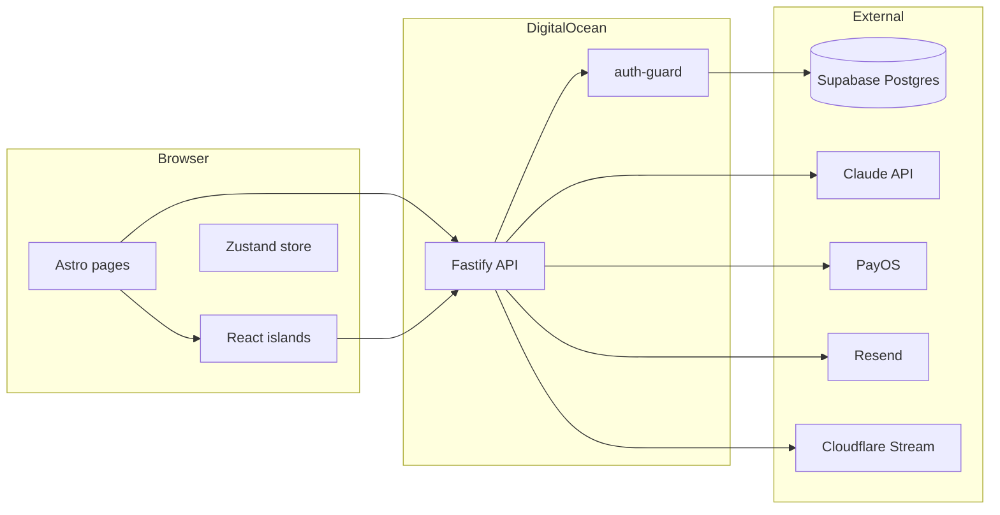

# FitWell MVP — Full Build Plan (+ Audit Integration)

> **Last updated:** March 2026 — Round 2 audit integrated.
> Sprint A (critical bugs) and Phase 1 gaps are **complete**. Round 2 audit findings are annotated with **[R2-Audit]** throughout each phase.

---

## Current state

- **In repo:** `api/` (Fastify), `web/` (Astro + React), `supabase/migrations/` (9 migrations), `web/src/design-system.tsx`, `supabase/seed.sql`, `env.example`, `.cursor/mcp.json`, `amendments-log.md`, and full docs: `docs/FitWell_TechSpec_v1_5_2.md`, `docs/screen spec/` (14 screen specs), `docs/FitWell_LoFi_Wireframe_Flow_v1_5.jsx`, `docs/FitWell_Emotional_Design_System_v1_2.jsx`.
- **Implemented:** Anonymous auth, onboarding intake flow, condition/protocol/session/checkin/progress API routes, S01–S17 screens, S30 notification setup, exercise player, S10 post-exercise, design system, check-in form.
- **Sprint A complete ✅:** `GET /api/v1/conditions` fixed; `d?.success?.data` → `d?.success && d?.data` across all components; `startExercise` uses `getAuthHeader()`; refreshTokenTTL corrected to 7d.
- **Phase 1 gaps complete ✅:** Assessment fork uses real `assessment_test_slug`; onboarding routes through assessment/insight; trial subscription row created; condition-specific insight copy; `GET/PATCH /api/v1/conditions/:id` added.
- **Still broken:** PayOS billing is 501; push notification pipeline is disconnected; `symptom-map` ignores user input; `ExercisePlayer` only renders first exercise; assessment result doesn't affect exercise selection.

Tech spec defines **two apps** in one repo: **fitwell-api** (Fastify) and **fitwell-web** (Astro). Phases P0–P6 are in `docs/FitWell_TechSpec_v1_5_2.md` (Part 11). **Tier 1 = full MVP:** symptom intake, protocol assignment, daily check-in, progress, exercise player, paywall/billing (PayOS), 7-day trial, Google OAuth + email/password, pattern detection, proactive nudges, re-engagement, add-condition.

---

## Architecture (from spec)



**Screen flow (simplified):** S01 Splash → S02 Pain Entry → S03 Hook / S03b Path Chooser → S04–S06 onboarding → S04A condition search / S04C confirm → S07–S08 First insight → S09–S10 Exercise player → S12–S13 Check-in (+ S30 notification) → S14–S17 Home / History / Progress. MSK forks: SMSK03 (check-in bifurcation), SMSK07 (assessment), SMSK08 (safety warning).

---

## Front-end development: design-system, wireframe, emotional design

All UI must follow `**web/src/design-system.tsx`** as the single source for components and tokens. No raw hex, no raw pixels, no one-off components that duplicate design-system exports.

### Design system

- **Tokens:** `colors`, `typography`, `spacing`, `radius`, `animation`, `touchTarget` — use these only; no Tailwind arbitrary values for spacing/color.
- **Components:** Section 12 "Component → Screen Registry" maps every screen-spec reference to an export. Before building any screen, resolve each spec "Components" row to a design-system export; do not create new components that already exist.
- **Protocol blocks:** Implement with `<ProtocolBlock variant="fear|insight|protocol|dry|honest|warmth|zero-guilt|peer-nod|pattern">` only.

### LoFi wireframe (`docs/FitWell_LoFi_Wireframe_Flow_v1_5.jsx`)

- Use the `PHASES` and `SCREENS` structure as the canonical order and set of screens. Each `SCREENS[id].render()` is a lo-fi layout reference.
- LoFi primitives → design-system: CP (rule) → `ProtocolBlock`; CpBtn (fill) → `PrimaryButton`; Chip → `PillButton`; ProgressBar (step) → `StepProgressBar`; DotGrid → `ConsistencyDotGrid`; Box → `SkeletonBlock`.

### Emotional Design System

- **Voice:** 4-layer contract (I see you, I understand, I won't waste your time, I won't lie). No motivational fluff, no exclamation encouragement.
- **Copy:** Enforce `.cursor/rules/copy-rules.mdc` and EDS "Rewrites" in every screen.
- **Global CSS (inject once):** Fonts (Be Vietnam Pro, Figtree, DM Mono) and keyframes: `fadeUp`, `typingDot`, `progIn`, `pulse`, `slideIn`.

### Per-screen implementation workflow

1. Open **LoFi wireframe** `SCREENS[screenId]` for layout.
2. Open **screen spec** for Components, Data Variables, Copy Slots, States, Navigation.
3. Map every component to **design-system** (Section 12); import from `@/design-system` only.
4. Apply **Emotional Design** tone and copy-rules.
5. Add global keyframes/fonts in root layout if not already present.

---

## Sprint A — Bug Fix ✅ COMPLETE

> All critical runtime bugs fixed. App now renders real data.

| ID | Area | File(s) | Bug | Status |
| --- | --- | --- | --- | --- |
| **C1** | API | `conditions.routes.ts` | `SELECT c.assessment_required` — column on `msk_conditions` not `conditions`. Every screen got Postgres 500. | ✅ Fixed — reads `m.assessment_required`, `m.assessment_test_slug`, `m.msk_slug` |
| **C2** | Frontend | 10+ components | `d?.success?.data` always `undefined` (`true?.data === undefined`). Home/Progress/History blank. | ✅ Fixed — `d?.success && d?.data` across all components |
| **H7** | Frontend | `CheckInForm.tsx:132` | `startExercise()` hardcoded `Anonymous` auth header, bypassing JWT. | ✅ Fixed — uses `getAuthHeader()` |
| **H10** | Frontend | `ConditionSelect.tsx:53` | Symptom-map always sent `'đau lưng'`; user's `?q=` ignored. | ✅ Fixed — reads real `?q=` param |
| **L2** | API | `auth.config.ts` | `refreshTokenTTL: '30d'` — spec says 7d. | ✅ Fixed — `'7d'` |
| **L3** | API | `onboarding.routes.ts:22` | Dead ternary `typeof slug === 'string' ? slug : slug`. | ✅ Fixed |

**Gate:** ✅ Passed — `GET /api/v1/conditions` returns 200; Home renders real data.

---

## Sprint B — Auth Completion

> Auth is the single largest unimplemented vertical. None of the P5 conversion features can work without it.

| ID | Area | File(s) | Bug / Gap | Fix |
| --- | --- | --- | --- | --- |
| **H1** | API | `auth.routes.ts` | No `POST /api/v1/auth/refresh` endpoint. Access tokens expire after 15 min with no recovery path. | Add refresh route that reads `httpOnly` refresh cookie and returns a new access token. |
| **H3** | API | `auth.routes.ts` | Only anonymous init exists. No email/password login or registration. `users.email`, `password_hash` are unreachable. | Add `POST /api/v1/auth/register` and `POST /api/v1/auth/login`. |
| **H4** | API + Web | `auth.routes.ts`, `web/src/lib/auth.ts` | `users.claimed_at` never written. Anonymous users can never log in from another device. | Add `POST /api/v1/auth/claim` (email+password, links anonymous user, returns JWT pair). |
| **L5** | Frontend | `web/src/pages/login.astro` | Static placeholder: "Màn hình đăng nhập sẽ có trong P5." | Wire up login React component once H3/H4 routes exist. |

**Gate:** User can register, login, refresh token silently, claim anonymous data from a new device.

---

## Phase 0 — Foundation ✅ (largely done; one gap)

**Goal:** `npm run dev` runs; anonymous session end-to-end; DB schema exists.

| # | Task | Status |
| --- | --- | --- |
| 0.1 | Repo structure (`api/`, `web/`, workspaces) | ✅ Done |
| 0.2 | DB migrations (9 migrations in `supabase/migrations/`) | ✅ Done |
| 0.3 | API skeleton (Fastify, CORS, health, shared middleware) | ✅ Done |
| 0.4 | Anonymous auth (`POST /auth/anonymous/init`, `Anonymous <id>` guard) | ✅ Done |
| 0.5 | Web skeleton (Astro + React, Tailwind, Zustand, `lib/auth.ts`, global CSS) | ✅ Done |
| 0.6 | VAPID keys + `push_subscriptions` table + `GET /config/push-key` | ✅ Done |

**[R2-Audit] Gap in P0:**

| ID | Gap | Fix |
| --- | --- | --- |
| **R-M4** | `anonymousInit()` always creates a new `users` row. Network retries or race conditions create orphaned anonymous user records. `api/src/modules/auth/anonymous.service.ts:9–16` | Use `INSERT INTO users ... ON CONFLICT (anonymous_id) DO NOTHING RETURNING id` pattern, or check for existing `anonymous_id` before insert. |

**Gate:** `npm run dev` (web + API) runs; anonymous init returns ID; health returns 200. ✅

---

## Phase 1 — Core loop ✅ (Phase 1 gaps complete; round-2 gaps remain)

**Goal:** First user completes Day 1 exercise; assessment fork and safety warning work; rule-based protocol only.

| # | Task | Status |
| --- | --- | --- |
| 1.1 | S01 Splash | ✅ Done (JWT redirect added) |
| 1.2 | S02 Pain Entry | ✅ Done |
| 1.3 | S03 Hook + S03b Path Chooser | ✅ Done |
| 1.4 | S04–S06 onboarding (S04A, S04C) | ✅ Done |
| 1.5 | Onboarding API (`POST /onboarding/intake`, condition factory, protocol create) | ✅ Done |
| 1.6 | Assessment fork (SMSK07) | ✅ Done — uses real `assessment_test_slug` from API |
| 1.7 | Safety warnings (SMSK08) | ✅ Done — routed through `/onboarding/insight` |
| 1.8 | S07–S08 First insight | ✅ Done — condition-specific copy map (8 conditions) |
| 1.9 | S09–S10 Exercise player (steps, timer, session start/complete) | ✅ Done |
| 1.10 | Sessions API | ✅ Done |
| 1.11 | `GET/PATCH /api/v1/conditions/:id` | ✅ Done |
| 1.12 | Trial subscription row on onboarding | ✅ Done — `condition-factory` inserts 7-day trial |

**[Round 1 Audit] P1 gaps — all complete ✅:**

| ID | Gap | Status |
| --- | --- | --- |
| **H8** | SMSK07 hardcoded `assessment_test_slug = 'prone_press_up'` | ✅ Fixed |
| **H9** | OnboardingDescribe + ConditionSelect skipped assessment+safety-warning | ✅ Fixed |
| **M4** | S07/S08 copy lumbar-specific only | ✅ Fixed — 8-condition lookup map |
| **M8** | No `GET/PATCH /api/v1/conditions/:id` | ✅ Fixed |
| **H11** | No trial subscription row on onboarding | ✅ Fixed |

**[R2-Audit] New gaps in Phase 1:**

| ID | Severity | File | Gap | Fix |
| --- | --- | --- | --- | --- |
| **R-H1** | HIGH | `ExercisePlayer.tsx:90` | Player only renders `exercises[0]`. Multi-exercise protocols (A+B circuits) are silently ignored — later exercises never play. | Track active exercise index. Advance to next exercise when last step of current exercise completes. |
| **R-H2** | HIGH | `ExercisePlayer.tsx:96,246` | `completed` state is set but **never called as `true`** anywhere in the component. The "session done" render branch at line 246 never executes. | Remove the dead `completed` state, or wire `setCompleted(true)` after the complete API call succeeds before navigating. |
| **R-H3** | HIGH | `api/src/modules/msk/assessment.routes.ts:38–47` | Assessment result (`protocol_a` / `protocol_b`) is stored but **never used** to select exercises. McKenzie vs. lateral-shift produce identical protocols. | Filter exercises by `clinical_tags` based on `assessment_result`: `mcKenzie` tag for `protocol_a`, `lateral_shift` for `protocol_b`. |
| **R-H9** | HIGH | `api/src/modules/onboarding/condition-factory.service.ts:99–109` | When no exercises exist for a body region, `protocol` is `null` with no error. S08 silently shows a broken "làm ngay" button the user can't use. | Return 422 or structured `no_exercise_available` flag so the frontend can surface a meaningful error. |
| **R-M3** | MEDIUM | `web/src/components/onboarding/S04CConfirm.tsx:131–153` | `handleContinue` calls `/api/v1/onboarding/intake` sequentially for each slug with no rollback. If 2nd intake fails after 1st succeeds, user has partial conditions and will create duplicates on retry. | Add `UNIQUE (user_id, msk_condition_id)` constraint (see DB section) and handle conflict gracefully in the factory. |
| **R-M6** | MEDIUM | `web/src/components/onboarding/S07FirstInsight.tsx:68–76` | Safety warning is stored in `sessionStorage` only — lost if tab is closed mid-flow. User skips critical safety content on browser restore. | Persist `show_safety_warning = true` flag on the `conditions` row server-side; check it at first exercise start. |
| **R-M7** | MEDIUM | `web/src/components/screens/S03bPathChooser.tsx:26–29` | Hardcoded hex values (`#F0EFE9`, `#6B6B64`) in inline `style` props, violating design-system token rule. | Replace with `colors.t0` and `colors.t2` from `@/design-system`. |
| **R-L2** | LOW | `ExercisePlayer.tsx:187` | Timer `useEffect` dependency `[currentStep, timerSec > 0]` — boolean expression is not a stable dep, causes spurious re-subscriptions and a lint warning. | Change to `[currentStep, step?.order]`; timer reads `timerSec` via functional update so doesn't need it as dep. |
| **R-L4** | LOW | `S04AConditionSearch.tsx:38`, `S04CConfirm.tsx:9` | `CONFIRM_SLUGS_KEY = 'fw_confirm_slugs'` is duplicated in two files with no shared constant. | Extract to `lib/session-keys.ts` imported by both. |

**Gate:** User can go S01 → … → S10 and complete D1 exercise; multi-exercise protocols play in order; assessment result selects correct exercise branch.

---

## Phase 2 — AI layer (Week 5–6)

**Goal:** Claude integration; Pain 5 branch; typing indicator; frozen shoulder Phase 1 no-stretch filter.

| # | Task | Status |
| --- | --- | --- |
| 2.1 | Claude integration (protocol.service, ai-provider, FITWELL_SYSTEM_PROMPT) | ❌ Not done |
| 2.2 | Context builder `buildAIContext()` (condition, phase, pain history) | ❌ Not done (file exists, not wired) |
| 2.3 | Pain 5 branch (no protocol; acknowledge + rest + red flag copy) | ⚠️ Hardcoded template only |
| 2.4 | Typing indicator (800ms min display) | ✅ Done in CheckInForm |
| 2.5 | Frozen shoulder filter B4 (`filterProhibitedExercises()`) | ❌ Not done |
| 2.6 | Lifestyle trigger (store/detect `trigger_event`) | ❌ Not done |

**[Round 1 Audit] Gaps from audit:**

| ID | Gap | Fix |
| --- | --- | --- |
| **H5** | `POST /onboarding/symptom-map` ignores `symptom_text`. Returns hardcoded top-5 with `confidence: 0.7`. | Implement keyword→slug matching against `name_vi`, `body_region`, `insight_hook_vi` using SQL `ILIKE` / `ts_rank`. No LLM required for P2 start; upgrade to Claude Haiku call at P2 end. |
| **H6** | Check-in route has hardcoded JSON templates; `context-builder.ts` and `system-prompt.ts` are dead code. | Import context builder; call Claude Haiku from checkin route; return real AI response. |

**[R2-Audit] New gaps in Phase 2:**

| ID | Severity | File | Gap | Fix |
| --- | --- | --- | --- | --- |
| **R-C3** | CRITICAL | `api/src/modules/onboarding/onboarding.routes.ts:44–58` | Identical to H5 — confirmed still broken post-Phase 1. Both `OnboardingDescribe` and `S04AConditionSearch` Tab B send user input but receive unrelated results. | Same fix as H5: SQL keyword matching. |
| **R-M2** | MEDIUM | `api/src/modules/onboarding/onboarding.routes.ts:45` | `symptom_text` not validated as string — `typeof text !== 'string'` causes `.slice is not a function` crash if body sends non-string. | Add `if (typeof text !== 'string') throw new AppError('VALIDATION_ERROR', 400)`. |
| **R-M8** | MEDIUM | `api/src/modules/checkin/checkin.routes.ts:92–101` | `standard` branch always sets `ai_response.protocol = null`. Permanently null field confuses future AI response format changes. | Remove the `protocol: null` field from `aiResponse` in the `standard` branch, or populate from actual protocol data. |
| **R-L1** | LOW | `api/src/modules/protocol-engine/prompts/context-builder.ts` | `buildAIContext()` is fully implemented with pain score history, phase, adaptation signal — but **never called** by `checkin.routes.ts`. Checkin uses hardcoded templates instead. | Wire `buildAIContext` into `checkin.routes.ts`. Call Claude Haiku when `ANTHROPIC_API_KEY` set; fall back to current templates otherwise. |

**Gate:** AI response P95 < 1.5s; Pain 5 verified; frozen shoulder Phase 1 gets no stretch exercises; symptom-map uses real keyword matching.

---

## Phase 3 — Daily loop (Week 7–8)

**Goal:** Check-in flow; in-app banner; web push and S30; progress tab; email retention.

| # | Task | Status |
| --- | --- | --- |
| 3.1 | S12–S13 Check-in (pain score, freetext, AI response) | ✅ Done (AI was hardcoded — fixed in P2) |
| 3.2 | Check-in API (`POST /checkins`, CHECKIN_ALREADY_EXISTS, AI) | ✅ Done (AI stub — fixed in P2) |
| 3.3 | InAppBanner (client:load, `GET /notifications/pending`) | ✅ Done |
| 3.4 | S30 push permission (one-shot, no retry on deny) | ⚠️ Partial — see R-C4 |
| 3.5 | Progress tab S14–S17 (Home, History, Progress, pain chart, consistency) | ✅ Done (data access fixed in Sprint A) |
| 3.6 | Email retention (Resend D+2, D+4, D+7) | ❌ Not done |

**[Round 1 Audit] Gaps from audit:**

| ID | Gap | Fix |
| --- | --- | --- |
| **M6** | Push subscription: `pushManager.subscribe()` never called; no POST to `/push-subscriptions`; `sw.js` has no `push` event listener. | (1) After grant, call `pushManager.subscribe({...vapidKey})`; (2) POST subscription JSON to new `POST /api/v1/push-subscriptions` route; (3) Add `push` event listener in `sw.js`. |
| **M10** | "Làm bài" button clickable even when `sessionDoneToday === true`. Creates duplicate sessions. | Add disabled state or confirm dialog when `sessionDoneToday`. |
| **M11** | S14 Home loads data for `conditions[0]` only. Multi-condition users see only first condition. | Add condition tab/selector; load data per selected condition. |
| **L6** | `notification_logs` may reference `/history/day/:date` deep-link; no such page exists. | Add `web/src/pages/history/[date].astro`. |
| **L7** | `trigger_event` in checkin accepts any string; no enum validation. | Add enum validation: `['morning', 'midday', 'pre_sleep', 'post_exercise', 'manual']`. |

**[R2-Audit] New gaps in Phase 3:**

| ID | Severity | File | Gap | Fix |
| --- | --- | --- | --- | --- |
| **R-C4** | CRITICAL | `web/src/components/notifications/S30NotificationSetup.tsx:30–46`, `public/sw.js:1–3` | Push pipeline completely disconnected: S30 calls `requestPermission()` but never `pushManager.subscribe()`. No `POST /api/v1/push/subscribe` endpoint. `sw.js` is 3 stub lines with no `push` event listener. All schemas (push_subscriptions, notification_schedules, VAPID config) exist but nothing connects them. | (1) After permission granted, call `registration.pushManager.subscribe({userVisibleOnly: true, applicationServerKey})`; (2) POST subscription to `POST /api/v1/push/subscribe` (save to `push_subscriptions`); (3) Add `push` event listener in `sw.js` calling `self.registration.showNotification(...)`. |
| **R-H6** | HIGH | `api/src/modules/schedule/schedule.routes.ts:12–15` | Daily schedule query JOIN missing `AND c.is_active = TRUE`. Deactivated conditions still appear in schedule. | Add `AND c.is_active = TRUE` to the query. |
| **R-H7** | HIGH | `web/src/components/shared/InAppBanner.tsx:14–16,28–30` | InAppBanner duplicates auth header construction inline instead of `getAuthHeader()`. Accesses `localStorage` without SSR guard. | Replace with `import { getAuthHeader } from '@/lib/auth'` and use `getAuthHeader()`. Add `typeof window !== 'undefined'` guard. |
| **R-H8** | HIGH | `api/src/modules/checkin/checkin.routes.ts:32,132` | `exercise_card.location` hardcoded to `'Tại nhà'` in both `GET /checkins/today` and `POST /checkins`. `exercises` table has real `location` column. | Include `location` in exercise SELECT queries and pass to `exercise_card.location`. |
| **R-M1** | MEDIUM | `web/src/components/home/S14Home.tsx:205–216` | `fw_reanchor_shown` read/written directly to `localStorage` inline. Hydration mismatch on SSR because flag resolves `false` server-side, causing `showReanchor` to briefly flash. | Move flag into `lib/prefs.ts` helper with proper SSR guard (`typeof localStorage !== 'undefined'`). |
| **R-L5** | LOW | `web/src/components/home/S14Home.tsx:353–355` | Check-in link renders as unstyled `<a>` tag adjacent to the "Làm bài ▶" button — inherits browser defaults, visually inconsistent. | Replace with `<GhostButton>` or apply `text-amber text-sm font-semibold` class. |

**Gate:** Web push subscribe E2E on Chrome Android; iOS in-app banner on focus; email D+2 sent; deactivated conditions excluded from schedule.

---

## Phase 4 — Progress and pattern (Week 9–10)

**Goal:** Pain chart, consistency, Day 7 summary; pattern cron; phase gate evaluator; morning critical 06:55.

| # | Task | Status |
| --- | --- | --- |
| 4.1 | Pain chart + consistency (S14–S17) | ✅ Done |
| 4.2 | Phase gate evaluator | ❌ Not done — see M5 |
| 4.3 | Pattern detection cron | ❌ Not done — see M7 |
| 4.4 | Morning critical 06:55 notification | ❌ Not done |
| 4.5 | SMSK05 multi-condition schedule builder | ❌ Not done |

**[Round 1 Audit] Gaps from audit:**

| ID | Gap | Fix |
| --- | --- | --- |
| **M5** | Phase gate is always `false` (hardcoded). `phase_progress.unlock_criteria` is never evaluated. | Add evaluation on session complete: read criteria, check counts, update `conditions.phase_current` when met. |
| **M7** | `pattern_observations` table is never written to from real check-in data. Pattern cards only show seed data. | Background job (3am VN): analyze last 14 days of check-ins per condition; insert observation row when pattern detected. |
| **M9** | No Fastify `schema:` validation on any route. Malformed payloads hit runtime code. | Add JSON schema validation to all mutation routes. |

**[R2-Audit] New gap in Phase 4:**

| ID | Severity | File | Gap | Fix |
| --- | --- | --- | --- | --- |
| **R-M6-safe** | MEDIUM | `web/src/components/onboarding/S07FirstInsight.tsx:68–76` | Safety warning stored in `sessionStorage` only — lost on browser close. User may skip critical clinical safety content on re-entry. (Relates to R-M6 in P1, but fix requires backend.) | Add `show_safety_warning` boolean column to `conditions`; write it at intake; clear it after user acknowledges in SMSK08. |

**Gate:** Phase unlock correct; pattern suggestion D14+; morning critical 06:55 fires.

---

## Phase 5 — Conversion (Week 10–12) — Tier 1

**Goal:** Paywall at Day 7; sign-up (Google OAuth + email/password); PayOS two-path; add-condition; subscription state; re-engagement flow.

| # | Task | Status |
| --- | --- | --- |
| 5.1 | Paywall D7 (block protocol/check-in after trial) | ❌ Not done — trial row exists (fixed P1), paywall middleware needed |
| 5.2 | Google OAuth + email/password | ❌ Not done (Sprint B prerequisite) |
| 5.3 | PayOS desktop path (QR + poll + webhook) | ❌ 501 stub |
| 5.4 | PayOS mobile path (redirect + return + webhook) | ❌ 501 stub |
| 5.5 | OI-2: PayOS expired link retry flow | ❌ Not done |
| 5.6 | S19b + S29 (post-paywall flow, add-condition modal) | ❌ Not done |
| 5.7 | Re-engagement (zero-guilt copy, reentry after churn) | ✅ Partial (S15 reengagement card implemented) |

**[Round 1 Audit] Gaps from audit:**

| ID | Gap | Fix |
| --- | --- | --- |
| **H11** | All billing routes return 501. No `subscriptions` row created on onboarding — paywall gate cannot be enforced. | (1) Trial row now created ✅; (2) implement PayOS `create-order` + `payos-webhook`; (3) add paywall middleware that reads `subscriptions.status`. |
| **L5** | `/paywall` page is static placeholder HTML. | Wire up paywall React component once H11 billing is done. |

**[R2-Audit] New gaps in Phase 5:**

| ID | Severity | File | Gap | Fix |
| --- | --- | --- | --- | --- |
| **R-C1** | CRITICAL | `api/src/modules/billing/billing.routes.ts:10,14,18` | All three PayOS endpoints (`/create-order`, `/payment-status`, `/payos-webhook`) return HTTP 501. Paywall page (`web/src/pages/paywall.astro`) is a static stub with no UI. | Implement PayOS create-order (QR + desktop polling path), mobile redirect path, and webhook signature verification + subscription activation. |
| **R-C2** | CRITICAL | `supabase/migrations/20260316000009_billing.sql:20–30` | `subscriptions` table has **no UNIQUE constraint on `user_id`**. `ON CONFLICT DO NOTHING` in condition-factory is a no-op — adds duplicate subscription rows each time a new condition is added. | New migration: `ALTER TABLE subscriptions ADD CONSTRAINT subscriptions_user_unique UNIQUE (user_id);`. See DB section. |
| **R-L3** | LOW | `supabase/migrations/20260316000009_billing.sql` | Once PayOS billing is implemented, a paid subscription insert will collide with the existing trial row for the same user (no UNIQUE means duplicate rows; with UNIQUE means the upsert needs updating too). | Use `ON CONFLICT (user_id) DO UPDATE SET plan_type = EXCLUDED.plan_type, status = EXCLUDED.status, expires_at = EXCLUDED.expires_at` in the billing webhook handler. |

**Front-end:** S19, S19b, S26, S27, S20, S29: build from LoFi wireframe + screen specs using design-system only. Paywall and re-engagement copy per Emotional Design and copy-rules.

**Gate:** Desktop QR poll and mobile redirect both confirm payment E2E; Google OAuth claims anonymous data; subscription state gates access correctly.

---

## Phase 6 — Launch prep (Week 12–14)

**Goal:** PostHog, Sentry, deploy, VAPID prod, OI-4 audit, perf, health.

| # | Task | Status |
| --- | --- | --- |
| 6.1 | PostHog (funnel events: onboarding → check-in → paywall → conversion) | ❌ Not done |
| 6.2 | Sentry (server-side DSN, error reporting) | ❌ Not done |
| 6.3 | Deploy (Vercel web, DigitalOcean API, custom domain, env vars) | ❌ Not done |
| 6.4 | VAPID production keys (no regeneration after launch) | ❌ Not done |
| 6.5 | OI-4 audit (`supabase/seed.sql` — every exercise row has ≥1 movement type in `clinical_tags`) | ❌ Not done |
| 6.6 | Perf + health (P95 API < 500ms; `GET /health` → 200) | ❌ Not done |

**[Round 1 Audit] Additional launch blockers:**

| ID | Gap | Fix |
| --- | --- | --- |
| **M1** | `user_profiles.user_id` missing UNIQUE constraint — duplicate profiles possible under concurrent requests. | New migration: `ALTER TABLE user_profiles ADD CONSTRAINT user_profiles_user_id_unique UNIQUE (user_id);` |
| **M2** | Missing indexes on `conditions(user_id)`, `conditions(msk_condition_id)`, `protocols(user_id)`, `sessions(protocol_id)`, `user_profiles(user_id)`, `pattern_observations(condition_id)`, `subscriptions(user_id, status)`. | New migration with all `CREATE INDEX IF NOT EXISTS` statements. |
| **M3** | `video_url` is fetched and stored in `ExercisePlayer` but never rendered — no `<video>` or Cloudflare Stream embed. | When `exercise.video_url` set, render `<iframe src="https://iframe.cloudflarestream.com/{id}">` at 38% viewport height. |
| **L1** | Rate-limit middleware is `await reply;` — a no-op that provides zero protection. | Implement in-memory rate limiting with `@fastify/rate-limit` (login: 10/15min; register: 5/1h). |
| **L4** | `red_flag_patterns` and `lifestyle_events` tables unused in production — no code reads or writes them. | Implement red-flag detection post-check-in (read `red_flag_patterns`); store lifestyle events from S05 trigger question. |

**[R2-Audit] Additional launch blockers:**

| ID | Severity | File | Gap | Fix |
| --- | --- | --- | --- | --- |
| **R-H4** | HIGH | `supabase/migrations/20260316000004_conditions_phase_protocols.sql` | Missing index on `conditions(user_id, is_active)`. Every authenticated route queries this table; full scan is significant at scale. | `CREATE INDEX idx_conditions_user ON conditions (user_id, is_active);` — see DB section. |
| **R-H5** | HIGH | `supabase/migrations/20260316000004_conditions_phase_protocols.sql` | Missing `UNIQUE (user_id, msk_condition_id)` on `conditions`. Double-tap or retry in S04C creates duplicate condition rows. | New migration: `ALTER TABLE conditions ADD CONSTRAINT conditions_user_msk_unique UNIQUE (user_id, msk_condition_id);`. |
| **R-M5** | MEDIUM | `supabase/migrations/20260316000001_users_auth.sql:19–27` | Missing index on `user_profiles(user_id)`. `GET /api/v1/me` and `buildAIContext` both query this; `user_id` FK has no index. | `CREATE INDEX idx_user_profiles_user ON user_profiles (user_id);` — see DB section. |
| **R-M9** | MEDIUM | `supabase/migrations/20260316000008_notifications.sql` | Missing index on `notification_logs(schedule_id, sent_at)`. Notification dispatch cron full-scans to find `last_sent_at` per schedule. | `CREATE INDEX idx_notif_logs_schedule ON notification_logs (schedule_id, sent_at DESC);` — see DB section. |

---

## Database — Pending migrations

All migrations needed before launch:

### `20260316000010_user_profiles_unique.sql`

```sql
-- Prevent duplicate user_profiles rows under concurrent onboarding
ALTER TABLE user_profiles
  ADD CONSTRAINT user_profiles_user_id_unique UNIQUE (user_id);
```

### `20260316000011_subscriptions_unique.sql`

```sql
-- Allow ON CONFLICT upsert in condition-factory and billing webhook
ALTER TABLE subscriptions
  ADD CONSTRAINT subscriptions_user_unique UNIQUE (user_id);
```

### `20260316000012_conditions_unique.sql`

```sql
-- Prevent duplicate condition rows on double-tap or retry in S04C
ALTER TABLE conditions
  ADD CONSTRAINT conditions_user_msk_unique UNIQUE (user_id, msk_condition_id);
```

### `20260316000013_indexes.sql`

```sql
-- High-frequency query paths
CREATE INDEX IF NOT EXISTS idx_conditions_user        ON conditions (user_id, is_active);
CREATE INDEX IF NOT EXISTS idx_conditions_msk         ON conditions (msk_condition_id);
CREATE INDEX IF NOT EXISTS idx_protocols_user_id      ON protocols (user_id);
CREATE INDEX IF NOT EXISTS idx_sessions_protocol      ON sessions (protocol_id);
CREATE INDEX IF NOT EXISTS idx_user_profiles_user     ON user_profiles (user_id);
CREATE INDEX IF NOT EXISTS idx_pattern_obs_condition  ON pattern_observations (condition_id);
CREATE INDEX IF NOT EXISTS idx_subscriptions_user     ON subscriptions (user_id, status);
CREATE INDEX IF NOT EXISTS idx_notif_logs_schedule    ON notification_logs (schedule_id, sent_at DESC);
```

---

## Cross-cutting

- **Front-end:** Every screen implemented from LoFi wireframe layout + screen spec (Components, Data, Copy, States, Navigation) using **design-system** components and tokens only; copy from Emotional Design and copy-rules. See workflow above.
- **Copy:** All UI Vietnamese; follow `.cursor/rules/copy-rules.mdc` and screen spec copy slots.
- **Design:** Use `web/src/design-system.tsx` only; no raw hex/pixels; touch targets and tokens per `.cursor/rules/design-system.mdc`.
- **Testing:** Before each screen commit, run smoke check per `.cursor/rules/testing.mdc`; log deviations in `amendments-log.md`.
- **API contract:** Follow `FitWell_TechSpec_v1_5_2.md` Part 4 and Section 1.4 (error codes, `{ success, data }` envelope). Access pattern: `if (d?.success && d?.data)` — never `d?.success?.data`.

---

## Consolidated sprint order

| Sprint | Items | Outcome |
| --- | --- | --- |
| **A — Bug Fixes** ✅ | C1, C2, H7, H10, L2, L3 | App renders real data; auth header works; symptom query passes through |
| **B — Auth** | H1, H3, H4 | Login, register, JWT refresh, anonymous claim |
| **P1 gaps** ✅ | H8, H9, H11, M4, M8 | Correct assessment flow; trial subscription created; condition-specific copy |
| **P1 R2 gaps** | R-H1, R-H2, R-H3, R-H9, R-M3, R-M7, R-L2, R-L4 | Multi-exercise player; assessment exercises correct; S04C safe |
| **P2 — AI** | H5/R-C3, H6/R-L1, R-M2, R-M8, 2.1–2.6 | Real Claude Haiku for check-in + symptom-map; context builder wired |
| **P3 — Daily loop** | R-C4, R-H6, R-H7, R-H8, M6, M10, M11, R-M1, L6, L7, R-L5, 3.3–3.6 | Push E2E; email retention; multi-condition home; schedule filtered |
| **P4 — Progress** | M5, M7, M9, R-M6-safe, 4.2–4.5 | Phase advancement; pattern cron; route validation; safety warning persisted |
| **P5 — Conversion** | R-C1, R-C2, R-L3, L5, 5.1–5.7 | PayOS E2E; unique subscriptions constraint; paywall enforced |
| **P6 — Launch** | M1, M2, M3, L1, L4, R-H4, R-H5, R-M4, R-M5, R-M9, 6.1–6.6 | DB hardened; indexes applied; rate limiting; PostHog/Sentry; deploy |

---

## Open decisions

- **Monorepo vs two repos:** Single repo with `api/` and `web/` is current approach — recommended to keep.
- **Red-flag detection:** `red_flag_patterns` table exists with seed data. Decision needed: run synchronously post-check-in (add latency) or async via queue. Recommendation: async job triggered by check-in webhook, writes to `notification_logs`.
- **Lifestyle events (S05 trigger):** `lifestyle_events` table exists. Decision needed: capture in check-in POST or separate route. Recommendation: add `trigger_event` field to check-in body (validation enum per L7).
- **Safety warning persistence:** Currently sessionStorage only (R-M6). Decision needed: store in `conditions` column or separate `user_flags` table. Recommendation: boolean column `show_safety_warning` on `conditions`, cleared after SMSK08 acknowledgement.
- **Assessment exercise selection (R-H3):** McKenzie vs. lateral-shift tags need to be present in `exercises.clinical_tags` seed data (OI-4 audit in P6). Check seed before implementing R-H3 fix.
