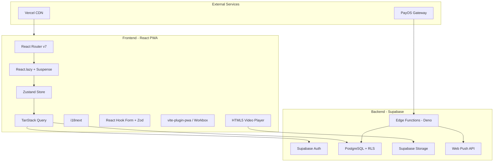

# FitWell PWA -- Complete Production Plan

## Current State Assessment

The project at [fitwell-mobile-pwa/](fitwell-mobile-pwa/) is a **high-fidelity UI prototype**:

- 50 screens implemented with React + TypeScript + Vite + Tailwind v4
- Custom state-based router (React Router v7.13.0 in deps but unused)
- 19/50 screens refactored to utility classes; 31 still use inline styles
- All text is hardcoded Vietnamese -- no i18n
- **Zero backend integration** -- no Supabase, no API calls, no auth, no data persistence
- Missing key deps: zustand, @tanstack/react-query, i18next, zod, @supabase/supabase-js, vite-plugin-pwa
- Missing `tsconfig.json`
- `src/app/components/index.ts` barrel file re-exports 50+ components (bundle bloat risk)
- Some screens use hardcoded hex `#041E3A` instead of `var(--navy)` CSS variable
- Unversioned `localStorage` keys used for transient state
- Design system (Ralph Lauren-inspired) is well-defined in [docs/FitWell_DesignSystem.md](docs/FitWell_DesignSystem.md)
- Full spec lives in [docs/FitWell_TechUX_Spec.md](docs/FitWell_TechUX_Spec.md) (v2.0, 1228 lines)

The gap: **everything below the UI layer** needs to be built.

---

## Architecture Overview




---

## Screen Registry (Navigation Map v2.0)

Canonical list linking Figma IDs to routes, types, v2.0 status, and implementation phase. Source: [docs/FitWell_Navigation_Map_v2.html](docs/FitWell_Navigation_Map_v2.html).

**Stats:** 50 frames across 10 flows. The table below has 39 rows; the remaining 11 frames are sub-screens and variants counted within compound entries: S4 has 5 sub-screens (4a–4e), S3 has 4 variants, and S8 has 2 sub-screens (S8a, S8b). Totals: 4 new (N1–N4) · 4 redesigned (S4, S5, S9, S16) · 12 updated · 30 unchanged · 7 home states · 7 push entry points.

> **Spec deviation:** TechUX Spec Section 1 specifies React Router **v6**. This plan uses React Router **v7** (7.13.0, already in `package.json`). v7 is API-compatible with v6 but ships as a separate major version. No downgrade needed; any v6 tutorial/doc applies directly. If the product team mandates v6, run `pnpm add react-router-dom@6` and update imports.


| ID  | Screen                         | Route                               | Type  | v2.0 | Phase |
| --- | ------------------------------ | ----------------------------------- | ----- | ---- | ----- |
| M2  | Register                       | /auth/register                      | Route | —    | 1     |
| M3  | Login (Magic Link)             | /auth/login                         | Route | —    | 1     |
| M4  | Magic Link Sent                | /auth/magic-link-sent               | Route | —    | 1     |
| N1  | Condition Declaration          | /onboarding (step 2a)               | Embed | NEW  | 1     |
| S1  | Language Selection             | /onboarding (step 1)                | Embed | —    | 1     |
| S2  | Biomarker Input                | /onboarding (step 2b)               | Embed | UPD  | 1     |
| S3  | Aha Intercept (4 variants)     | /onboarding (conditional)           | Embed | UPD  | 1     |
| S4  | Life Pattern (5 sub-screens)   | /onboarding (step 3)                | Embed | REDO | 1     |
| S5  | Activation Event (4 options)   | /onboarding (step 4)                | Embed | REDO | 1     |
| M1  | A2HS Prompt                    | /onboarding/a2hs                    | Route | —    | 1     |
| S6  | Home: Morning State            | /home (state 6)                     | State | —    | 1     |
| S7  | Home: Sunday Brief             | /home (state 1)                     | State | —    | 1     |
| M5  | Home: Pre-Dinner Countdown     | /home (state 4)                     | State | —    | 1     |
| M6  | Home: Active Recovery          | /home (state 3)                     | State | UPD  | 1     |
| M7  | Home: Clean Day                | /home (state 7)                     | State | —    | 1     |
| M8  | Home: Monday Intercept         | /home (state 2)                     | State | —    | 1     |
| S21 | Home: Pre-Sleep / Check-in     | /home (state 5) · /checkin/presleep | State | —    | 1, 3  |
| S8  | Morning Check-in (2–3 screens) | /checkin/morning                    | Embed | UPD  | 3     |
| N2  | Back Pain Score (conditional)  | /checkin/morning (Q3)               | Embed | NEW  | 3     |
| S9  | Post-Event Intensity           | /checkin/post-event                 | Embed | REDO | 3     |
| N3  | Post-Event Type Selector       | /checkin/post-event (Q2)            | Embed | NEW  | 3     |
| S10 | Midday Desk Check-in           | /checkin/midday                     | Embed | UPD  | 3     |
| S11 | Context Selector               | (embed in action flow)              | Embed | —    | 3     |
| S12 | Timer: Pre-Start               | (embed, full-screen)                | Embed | UPD  | 3     |
| S13 | Timer: Running                 | (embed, full-screen)                | Embed | —    | 3     |
| M9  | Timer: Complete                | (embed, full-screen)                | Embed | —    | 3     |
| S17 | Recovery Day 1 (variants)      | /home (via Active Recovery)         | State | UPD  | 3     |
| S18 | Day 2 Paywall                  | /recovery (gated)                   | Route | —    | 3     |
| S15 | Scenario Search                | /scenario/search                    | Route | UPD  | 2     |
| S16 | Playbook: Food/Drink           | /scenario/:id                       | Route | REDO | 2     |
| N4  | Playbook: Desk/Stress          | /scenario/:id (variant)             | Route | NEW  | 2     |
| S14 | Weekly Brief                   | /brief                              | Route | UPD  | 5     |
| AL  | Action Library Browse          | /actions                            | Route | UPD  | 3     |
| M12 | Household Invite               | /household/invite                   | Route | —    | 7     |
| S19 | Partner Home View              | /home (partner role)                | State | UPD  | 7     |
| S20 | Profile & Settings             | /profile                            | Route | UPD  | 1     |
| S22 | Pricing                        | /pricing                            | Route | —    | 6     |
| M10 | Payment Success                | /payment/success                    | Route | —    | 6     |
| M11 | Payment Cancel                 | /payment/cancel                     | Route | —    | 6     |


**Traceability:** Add the Frame ID (e.g. `// Figma: M2`) as a comment at the top of each component file for design–dev alignment.

**Existing prototype components not in the Navigation Map (orphans):** These screens exist in `fitwell-mobile-pwa/src/app/components/` but have no corresponding Figma frame. They are prototype explorations; decide during Phase 8 whether to integrate, repurpose, or delete:


| Component                        | Purpose (from prototype)        | Recommendation                                            |
| -------------------------------- | ------------------------------- | --------------------------------------------------------- |
| `ProgressScreen.tsx`             | Habit progress tracker + charts | Repurpose as sub-tab of /profile or future "Insights" tab |
| `BloodTestScreen.tsx`            | Blood test result viewer        | Embed under /profile as biomarker detail view             |
| `DashboardScreen.tsx`            | Overview dashboard (English)    | Delete — superseded by HomeScreen state machine           |
| `RecoveryPlanScreen.tsx`         | Recovery plan view              | Merge into RecoveryProtocolActiveScreen or delete         |
| `CheckInQuestionScreen.tsx`      | Generic check-in question       | Delete — superseded by specific check-in flow components  |
| `OnboardingScreen.tsx`           | Parent onboarding shell         | Keep as route shell wrapping step embeds                  |
| `HomeMiddayScreen.tsx`           | Midday home state               | Review — may duplicate S6 morning or be unused variant    |
| `HouseholdInviteStateScreen.tsx` | Household invite status         | Merge into HouseholdInviteScreen or keep as state view    |
| `ActionCompletionScreen.tsx`     | Post-action completion          | Review — may be embedded in MicroActionFlow               |
| `TimerCompleteScreen.tsx`        | Timer done (alternative to M9)  | Review — may duplicate ActionCompletionScreen or M9       |


**Monday Brief Intercept clarification:** Two components exist: `HomeMondayBriefInterceptScreen.tsx` (refactored, uses `fw-` utility classes) and `MondayBriefInterceptScreen.tsx` (inline styles, older). **Use `HomeMondayBriefInterceptScreen.tsx`** for the M8 home state and `/brief/intercept` route. Delete `MondayBriefInterceptScreen.tsx` during Phase 8 refactoring.

---

## Phase 0 -- Foundation (Week 1-2)

### 0.1 Project Infrastructure

- Add `tsconfig.json` with strict mode, path aliases (`@/` -> `src/`)
- Install missing core dependencies:
  - `@supabase/supabase-js` (Supabase client)
  - `zustand` (global state)
  - `@tanstack/react-query` (data fetching/cache)
  - `i18next` + `react-i18next` (i18n)
  - `react-hook-form` + `zod` + `@hookform/resolvers` (form validation — used in onboarding biomarker input, profile edit, payment forms)
  - `vite-plugin-pwa` (service worker management)
  - `lucide-react` (icon library — replaces MUI icons per spec)
  - `shadcn/ui` components via `npx shadcn-ui@latest init` (per TechUX Spec: "unstyled, composable, works with Tailwind"). Use shadcn primitives (Button, Dialog, Sheet, Drawer, Input) instead of building custom UI primitives from scratch. Existing `src/app/components/ui/` may already wrap some of these — reconcile during setup.
- **Fix `react` / `react-dom`:** Currently in `peerDependencies` only — move to `dependencies` to ensure they are installed.
- **Keep React Router v7** (7.13.0 already in deps) -- adopt its routing API instead of the custom `useState` router. v7 has the same API as v6 but ships as a separate major; TechUX Spec says v6 — see deviation note in Screen Registry above. No downgrade needed.
- Remove MUI dependencies (`@mui/material`, `@mui/icons-material`, `@emotion/react`, `@emotion/styled`) -- the spec calls for Lucide icons only. **Migrate all MUI icon imports** (`import { X } from '@mui/icons-material'`) to Lucide equivalents (`import { X } from 'lucide-react'`).
- Remove unused deps: `react-dnd`, `react-dnd-html5-backend`, `react-popper`, `@popperjs/core`, `react-slick`, `react-responsive-masonry` (not used in any screen)
- **Grep for `DM Mono`** references in prototype CSS/components — DM Mono was replaced by IBM Plex Mono because DM Mono clips stacked Vietnamese diacritics in uppercase. Remove any remaining `DM Mono` references.
- Set up `.env` / `.env.local` for Supabase URL, anon key, VAPID keys, PayOS keys

### 0.2 Performance Architecture (Vercel React Best Practices)

**Bundle Splitting (rules `bundle-barrel-imports`, `bundle-dynamic-imports`):**

- **Delete `src/app/components/index.ts` barrel file.** Import each screen directly in the router. Barrel files add 200-800ms import cost per Vercel rule 2.1.
- **Route-based code splitting with `React.lazy()` + `Suspense`** for all screen components. Every route loads its screen on demand:

```tsx
const HomeScreen = lazy(() => import('./components/HomeScreen'));
const PricingScreen = lazy(() => import('./components/PricingScreen'));
const WeeklyBriefScreen = lazy(() => import('./components/WeeklyBriefScreen'));
```

- **Dynamically import heavy libraries:**
  - `recharts` -- only used on ProgressScreen/DashboardScreen, ~200KB. Load on demand.
  - Heavy Radix components (Drawer, Sheet, Dialog) -- lazy-load when first opened.
  - `motion` (framer-motion) -- defer loading until screen transition needed.

**Font Optimization:**

- Self-host fonts via `@fontsource/be-vietnam-pro`, `@fontsource/ibm-plex-mono`, `@fontsource/dm-serif-display` for Vercel edge CDN delivery instead of third-party Google Fonts origin.
- **Conditionally load DM Serif Display** -- it's used on exactly 2 screens (MicroActionTimerScreen + OnboardingAhaScreen). Load it only when those screens are navigated to, not in the initial bundle.
- Verify `<link rel="preconnect">` tags in `index.html` if keeping Google Fonts fallback.

**TanStack Query Defaults:**

- Static content (`scenarios`, `micro_actions`): `staleTime: Infinity` -- these change rarely
- User data (`checkins`, `action_sessions`, `recovery_protocols`): `staleTime: 0` with background refetch
- Profile data (`profiles`, `biomarkers`): `staleTime: 5 * 60 * 1000` (5 minutes)

**Zustand Selector Discipline (rule `rerender-derived-state`):**

- All store subscriptions must use selectors: `useAuthStore(s => s.profile)` not `useAuthStore()`
- Never destructure the entire store -- subscribe only to the fields the component reads
- Document this as a project rule in `.cursor/rules/`

**localStorage Cleanup (rule `client-localstorage-schema`):**

- Remove unversioned keys (`fitwellFirstMicroAction`, `currentWeek`, `checkInAnswer`)
- Migrate transient state to Zustand with `persist` middleware using a versioned schema

**Flow-to-Code-Split Mapping (Navigation Map flows A–J):**


| Flow | Name              | Lazy chunk             | i18n namespace   |
| ---- | ----------------- | ---------------------- | ---------------- |
| A    | Auth              | auth                   | common, auth     |
| B    | Onboarding        | onboarding             | onboarding       |
| C    | Home              | home (eager)           | common           |
| D    | Check-in          | checkin                | checkin          |
| E    | Timer + Recovery  | action                 | action           |
| F    | Scenario Playbook | scenario               | scenario         |
| G    | Weekly Brief      | brief                  | brief            |
| H    | Action Library    | action (shared with E) | action           |
| I    | Household         | household              | household        |
| J    | Profile / Payment | profile                | profile, payment |


### 0.2a Design System Enforcement

The [Design System](docs/FitWell_DesignSystem.md) defines exact tokens, motion rules, and component specs that the plan must enforce. Do this before building features.

**Tailwind Config Reconciliation (Design System Section 09):**

- Verify `tailwind.config.js` matches the spec's `colors`, `fontFamily`, `fontSize`, `borderRadius`, `spacing`, and `transitionDuration` tokens exactly. The Design System provides the full config — apply it verbatim.
- Key tokens to verify: `navy` (#041E3A), `grey-surface` (#F5F5F5), `grey-warm` (#EBEBF0), `grey-text` (#9D9FA3), `gold` (#8C693B), `amber` (#D97706), `risk` (#DC2626), `success` (#059669).
- Verify `theme.css` CSS custom properties match Tailwind config (they should be the source of truth for CSS-var-based components).
- Spacing tokens: `space-1` (4px) through `space-16` (64px) — verify present and applied.

**Motion Rules (Design System Section 08):**

CSS-only transitions. No spring physics, no bounce, no scale transforms.


| Interaction          | Duration   | Easing                    | Implementation                                |
| -------------------- | ---------- | ------------------------- | --------------------------------------------- |
| Check-in card select | 120ms      | ease-out                  | `transition: background-color 120ms ease-out` |
| Screen transition    | 200ms      | ease-in-out               | Slide left/right — never fade                 |
| Timer start/complete | 150ms      | ease-out                  | Button label swap only                        |
| Bottom sheet open    | 250ms      | cubic-bezier(0.4,0,0.2,1) | Slides up                                     |
| Unread dot appear    | 0ms        | none                      | Instant — information, not alert              |
| Risk calendar rows   | 0ms        | none                      | Static, no stagger                            |
| A2HS illustration    | 600ms loop | ease-in-out               | Subtle Safari share icon pulse only           |


**framer-motion decision:** If `motion` (framer-motion) is kept for page transitions, configure it to use **only** `tween` type with explicit `duration` and `ease` matching the table above. Disable all `spring` defaults. Alternatively, implement transitions with CSS `transition` and `@starting-style` to eliminate the dependency entirely. Document the decision in `.cursor/rules/`.

**Component Pattern Specs (Design System Section 06):**

Create a `.cursor/rules/design-system.mdc` rule documenting:

- 6 button types with exact padding, font, border-radius specs
- Check-in option card: exact padding (16px), gap (12px), 1px `#EBEBF0` border, 120ms selection animation
- Bottom nav: height, 1px top border, 48px tap targets (not 44px), unread dot specs (6px `#D97706`)
- Eyebrow Label Hierarchy: IBM Plex Mono uppercase above Be Vietnam Pro headline — enforced on every action card and scenario header
- Screen edge margins: 20px — non-negotiable
- Border radius: 0px full-screen, 4px cards, 2px badges, 8px modals — no larger
- No shadows anywhere — 1px `#EBEBF0` border separates surfaces
- Contrast guard: never pair `#9D9FA3` on `#F5F5F5` for body copy (fails WCAG AA at small sizes)

**Scenario Playbook Imagery (Design System Section 07):**

- Header: full-bleed image, dark overlay `rgba(4,30,58,0.60)`, white text
- Images show environment (restaurant, BBQ, hotel) — no faces
- Min 1200×800px, compressed < 200KB for 4G
- Desk/Stress variant (N4): no image — navy solid background
- "Tránh" (avoid) section: **red-tinted background** (#DC2626 at 5-10% opacity) to visually differentiate from other sections

### 0.3 Supabase Setup

- Create Supabase project (Singapore region for data residency)
- Run all schema migrations from the TechUX Spec Section 2:
  - `profiles` (with `primary_conditions[]`, notification prefs)
  - `households`
  - `biomarkers` (9 marker types)
  - `scenarios` (20 seed records, 7 categories)
  - `scenario_sessions`
  - `checkins` (4 trigger types, v2.0 expanded enums)
  - `micro_actions` (24 seed records, 8 categories)
  - `action_sessions`
  - `recovery_protocols`
  - `push_subscriptions`
  - `notification_governor`
  - `subscriptions`
  - `weekly_briefs`
- **v2.0 column-level changes** (verify these are in the migration SQL, not just the spec text):
  - `checkins.back_pain_score` (integer, nullable) — for N2 Back Pain Score conditional question
  - `checkins.event_type` (enum: rich_meal, heavy_night, long_desk, stress_day, travel, poor_sleep) — for N3 Post-Event Type Selector
  - `checkins.afternoon_state` add 'back_tight' enum value — for midday priority override
  - `scenarios`: rename `biomarker_tags` → `condition_tags`, rename `alcohol_strategy` → `meal_strategy`, add `desk_breaks` (jsonb, string[]) for desk/stress playbooks, add `read_time_minutes` (integer) for search results
  - `micro_actions`: rename `biomarker_tags` → `condition_tags`
  - `profiles.free_post_event_checkins_used` (integer, default 0) — free-tier counter
  - `profiles.free_scenario_uses` (integer, default 0) — free-tier counter
  - `profiles.brief_weeks_completed` (integer, default 0) — brief tier progression
  - `recovery_protocols.event_type` (enum, matching checkins.event_type) — for recovery eyebrow variant selection
- **Audit columns** on `checkins`, `scenario_sessions`, `action_sessions`:
  - `day_of_week` (integer 0–6) — populate via trigger or client-side on insert
  - `hour_of_day` (integer 0–23) — populate via trigger or client-side on insert
  - These enable the weekly brief insight queries to aggregate by day/hour patterns
- **CHECK constraints:** `scenarios.risk_level` between 1 and 5, `recovery_protocols.day` between 1 and 3, `weekly_briefs.insight_tier` between 1 and 4
- Enable RLS on all tables; write policies (users read/write own data only)
- Create `updated_at` trigger function
- Seed `scenarios` table with 20 playbooks (vi + en content) — see Seed Data Manifest below
- Seed `micro_actions` table with 24 actions (vi + en, condition_tags, context_tags) — see Seed Data Manifest below
- Create Supabase Storage bucket `exercise-videos` (public read)
- Create Storage bucket `video-thumbnails` (public read)

### 0.3a Seed Data Manifests

Verify all seed records match the OnePager and TechUX Spec. Create seed SQL files with these exact records.

**20 Scenario Playbooks (7 categories):**


| #   | Category       | Name (vi)         | Conditions             | Risk |
| --- | -------------- | ----------------- | ---------------------- | ---- |
| 1   | Hải sản & Nhậu | Tiệc hải sản      | gout                   | 5    |
| 2   | Hải sản & Nhậu | Korean BBQ        | gout, cholesterol      | 4    |
| 3   | Hải sản & Nhậu | Nhậu đêm          | gout                   | 5    |
| 4   | Bữa ăn         | Bàn tiệc Tết      | gout, cholesterol      | 5    |
| 5   | Bữa ăn         | Tiệc cưới         | cholesterol            | 4    |
| 6   | Bữa ăn         | Cơm khách hàng    | cholesterol            | 3    |
| 7   | Bữa ăn         | Buffet khách sạn  | gout, cholesterol      | 4    |
| 8   | Văn phòng      | Họp marathon      | back_pain              | 3    |
| 9   | Văn phòng      | Sprint 10 tiếng   | back_pain              | 4    |
| 10  | Văn phòng      | Ngày hội nghị     | back_pain              | 3    |
| 11  | Căng thẳng     | Deadline tuần     | back_pain              | 4    |
| 12  | Căng thẳng     | Review hiệu suất  | back_pain              | 3    |
| 13  | Căng thẳng     | Leo thang quản lý | back_pain              | 4    |
| 14  | Công tác       | Công tác 2 ngày   | back_pain, cholesterol | 4    |
| 15  | Công tác       | Phòng chờ sân bay | cholesterol            | 3    |
| 16  | Công tác       | Phòng khách sạn   | back_pain              | 3    |
| 17  | Công tác       | Jet lag / múi giờ | back_pain              | 3    |
| 18  | Khác           | Ngày nắng nóng    | gout                   | 3    |
| 19  | Khác           | Cuối tuần lười    | back_pain, cholesterol | 2    |
| 20  | Khác           | Đêm mất ngủ       | back_pain              | 3    |


**24 Micro-Actions (8 categories):**


| #   | Cat                     | Name                                 | Duration | Conditions             | Contexts                 |
| --- | ----------------------- | ------------------------------------ | -------- | ---------------------- | ------------------------ |
| 1   | A: Metabolic Reset      | Wall Sit                             | 2 min    | gout, cholesterol      | office, private          |
| 2   | A                       | Standing Hip Hinges                  | 3 min    | cholesterol            | office, private          |
| 3   | A                       | Cold Water Face Reset                | 1 min    | gout                   | office, private, transit |
| 4   | B: Morning Recovery     | First-Hour Hydration Flush           | 3 min    | gout                   | private                  |
| 5   | B                       | Ankle & Big Toe Mobility             | 4 min    | gout                   | private                  |
| 6   | B                       | Post-Meal Walk Protocol              | 5 min    | cholesterol            | office, private          |
| 7   | C: Glucose Response     | Postprandial Squat Sequence          | 3 min    | cholesterol            | office, private          |
| 8   | C                       | Desk Calf Raises                     | 2 min    | cholesterol            | office                   |
| 9   | C                       | Breathing Reset for Lipid Metabolism | 4 min    | cholesterol            | office, private, transit |
| 10  | D: Spinal Decompression | Lumbar Floor Release                 | 3 min    | back_pain              | private                  |
| 11  | D                       | Doorframe Chest Opener               | 2 min    | back_pain              | office, private          |
| 12  | D                       | Standing Thoracic Rotation           | 3 min    | back_pain              | office, private          |
| 13  | E: Stress / Mental      | 4-7-8 Breathing                      | 4 min    | back_pain              | office, private, transit |
| 14  | E                       | Jaw Release Sequence                 | 2 min    | back_pain              | office, private          |
| 15  | E                       | Standing Tension Sweep               | 3 min    | back_pain              | office, private          |
| 16  | F: Pre-Sleep            | Supine Spinal Twist                  | 3 min    | back_pain              | private                  |
| 17  | F                       | Progressive Muscle Relaxation        | 5 min    | back_pain              | private                  |
| 18  | F                       | Blue Light Wind-Down Protocol        | 2 min    | back_pain              | private                  |
| 19  | G: Post-Night Recovery  | Supine Knee Hugs                     | 3 min    | gout, back_pain        | private                  |
| 20  | G                       | Post-Night Hydration Protocol        | 3 min    | gout                   | private                  |
| 21  | G                       | Hotel Room Floor Circuit             | 5 min    | back_pain              | private                  |
| 22  | H: Desk Break           | Desk Blood Flow Circuit              | 3 min    | cholesterol, back_pain | office                   |
| 23  | H                       | Eye Relief & Neck Reset              | 2 min    | back_pain              | office                   |
| 24  | H                       | Standing Spinal Extension            | 2 min    | back_pain              | office                   |


### 0.4 Frontend Foundation

- Create `src/lib/supabase.ts` -- Supabase client singleton
- Create `src/lib/i18n.ts` -- i18next config with `vi`/`en`, **namespace-based lazy loading** (one namespace per screen group, loaded on route entry)
- Create `src/locales/vi/` and `src/locales/en/` with namespaced JSON files:
  - `common.json` (shared strings: nav labels, buttons, errors)
  - `auth.json` (auth screens: "Đã có tài khoản?", "Đăng ký", etc.)
  - `onboarding.json`, `checkin.json`, `scenario.json`, `action.json`, `brief.json`, `profile.json`, `payment.json`, `household.json`
- Create `src/store/` -- Zustand stores (all with selector discipline):
  - `authStore.ts` (user session, profile)
  - `checkinStore.ts` (current check-in state)
  - `protocolStore.ts` (active recovery protocol)
  - `uiStore.ts` (current screen, navigation history, bottom nav state)
- Create `src/types/` -- TypeScript types matching DB schema
  - `database.ts` (generated from Supabase or manually typed)
  - `checkin.ts`, `scenario.ts`, `action.ts`, `protocol.ts`
- Create `src/hooks/useSupabaseQuery.ts` -- TanStack Query + Supabase wrapper
- **Adopt React Router v7 routing API:**
  - Route structure per TechUX Spec Section 3 and [Navigation Map v2.0](docs/FitWell_Navigation_Map_v2.html)
  - **Route configuration (21 distinct routes):** Only Route-type screens get their own path and `React.lazy()`; Embed/State screens are bundled with their parent.


| Route                 | Frame(s)                                               | Load strategy                          |
| --------------------- | ------------------------------------------------------ | -------------------------------------- |
| /auth/register        | M2                                                     | lazy                                   |
| /auth/login           | M3                                                     | lazy                                   |
| /auth/magic-link-sent | M4                                                     | lazy                                   |
| /onboarding           | S1, N1, S2, S3, S4, S5 (embeds)                        | lazy (single route, step state inside) |
| /onboarding/a2hs      | M1                                                     | lazy                                   |
| /home                 | S6, S7, M5, M6, M7, M8, S21, S17, S19 (state variants) | eager (primary entry)                  |
| /checkin/morning      | S8, N2 (embeds)                                        | lazy                                   |
| /checkin/post-event   | S9, N3 (embeds)                                        | lazy                                   |
| /checkin/midday       | S10, S11 (embeds)                                      | lazy                                   |
| /checkin/presleep     | S21                                                    | lazy                                   |
| /scenario/search      | S15                                                    | lazy                                   |
| /scenario/:id         | S16, N4 (variant)                                      | lazy                                   |
| /brief                | S14                                                    | lazy                                   |
| /brief/intercept      | M8 (Monday intercept entry)                            | lazy                                   |
| /actions              | AL                                                     | lazy                                   |
| /recovery             | S18 (gated)                                            | lazy                                   |
| /household/invite     | M12                                                    | lazy                                   |
| /profile              | S20                                                    | lazy                                   |
| /pricing              | S22                                                    | lazy                                   |
| /payment/success      | M10                                                    | lazy                                   |
| /payment/cancel       | M11                                                    | lazy                                   |


- **Bottom nav visibility:** Hide on auth screens, onboarding, timer (full-screen), check-in flow, A2HS prompt, payment confirmation. Show on home, scenario search, actions, brief, profile, recovery (when shown), household invite.
- **"Check-in" bottom nav tab routing:** The bottom nav has a "Check-in" tab but there is no single `/checkin` base route — check-ins are triggered contextually (morning, midday, post-event, pre-sleep). The "Check-in" tab should open the **contextually appropriate** check-in: evaluate time of day (morning vs. afternoon vs. evening), pending triggers (post-event armed?), and user state. If no trigger is active, show the morning check-in as default. Implement this logic in the bottom nav `onClick` handler, not as a static route.
- Protected routes (auth guard)
- Onboarding guard (redirect if `onboarding_complete === false`)

### 0.5 PWA & Deploy

- Configure `vite-plugin-pwa` with Workbox (replaces manual `sw.js`):
  - Precache static assets (HTML shell, JS chunks, CSS, fonts)
  - Cache video thumbnails (runtime cache, stale-while-revalidate)
  - Skip full videos (too large for cache)
  - **Update strategy:** `skipWaiting` + `clientsClaim` — immediate activation for quick iteration during beta. Consider prompt-based update strategy post-launch.
  - **Offline-readable core screens:** Home (cached state), Profile (cached data), Action Library (cached list), Micro-Action Timer (text-only fallback if video unavailable). Other screens show offline indicator with retry button.
- **PWA manifest fields** (verify in `manifest.json`):
  - `name`: "FitWell" / `short_name`: "FitWell"
  - `theme_color`: "#041E3A" (navy)
  - `background_color`: "#FFFFFF"
  - `display`: "standalone"
  - `start_url`: "/home"
  - `scope`: "/"
  - `orientation`: "portrait"
- Generate PWA icons from `public/icon-source.svg` (all sizes: 192×192, 512×512, maskable)
- Set up Vercel project with custom domain
- Configure Vercel environment variables
- CI pipeline: `pnpm build` on push to main

---

## Phase 1 -- i18n + Auth + Onboarding (Week 3-5)

### 1.0 i18n Extraction (MOVED from Phase 8 -- do BEFORE backend wiring)

Extracting strings becomes exponentially harder after backend integration. Every new feature from here on must use translation keys, not hardcoded text.

- Extract all hardcoded Vietnamese strings from 50 screens into namespaced i18n JSON files
- Create English translations for all screens
- i18n namespaces loaded lazily per route group (not all upfront)
- Test language switch end-to-end
- Establish rule: **no new hardcoded strings from this point forward**

### 1.1 Authentication

- Implement Supabase Auth:
  - Email/password registration ([AuthRegisterScreen](fitwell-mobile-pwa/src/app/components/AuthRegisterScreen.tsx))
  - Magic link login ([AuthLoginMagicLinkScreen](fitwell-mobile-pwa/src/app/components/AuthLoginMagicLinkScreen.tsx))
  - Magic link sent confirmation ([AuthMagicLinkSentScreen](fitwell-mobile-pwa/src/app/components/AuthMagicLinkSentScreen.tsx))
- Create `profiles` row on registration (Supabase trigger or client-side)
- Wire auth state to Zustand `authStore`
- Implement session persistence and auto-refresh

### 1.2 Onboarding Flow (4 Steps + Aha Intercept · 8 screens · v2.0 changes)

> Matches TechUX Spec Section 3: "Onboarding Flow (4 Steps + Aha Intercept)". Step count excludes the Aha Intercept, which fires conditionally between steps 2 and 3.

- **Step 1 -- Language Selection** ([OnboardingLanguageScreen](fitwell-mobile-pwa/src/app/components/OnboardingLanguageScreen.tsx)) (S1)
  - Write `profiles.language` to Supabase
  - Switch i18next locale
- **Step 2a -- Condition Declaration** ([OnboardingConditionScreen](fitwell-mobile-pwa/src/app/components/OnboardingConditionScreen.tsx)) (**N1 · NEW v2.0**)
  - Multi-select: Gout / Cholesterol / Back pain / Unsure → `profiles.primary_conditions[]`
  - New screen; implement from spec, not just data wiring
- **Step 2b -- Biomarker Input** ([OnboardingBiomarkerScreen](fitwell-mobile-pwa/src/app/components/OnboardingBiomarkerScreen.tsx)) (S2 · Updated)
  - Insert rows to `biomarkers` table
  - Marker dropdown sorted by declared conditions
  - Skip option available
- **Aha Intercept** ([OnboardingAhaScreen](fitwell-mobile-pwa/src/app/components/OnboardingAhaScreen.tsx)) (S3 · Updated)
  - 4 variants by condition: Gout / Cholesterol / Back pain / Multi-condition
- **Step 3 -- Life Pattern** ([OnboardingLifePatternScreen](fitwell-mobile-pwa/src/app/components/OnboardingLifePatternScreen.tsx)) (**S4 · REDESIGNED**)
  - 5 sub-screens (layout rework required): 4a Desk hours (dưới 6 / 6–8 / 8+), 4b Eating out frequency, **4c Back/neck pain frequency (NEW)**, **4d Highest-risk environment multi-select max 2 (NEW)**, 4e Account usage (solo / + partner)
  - If 4e = partner → branch to /household/invite; else → Step 4
- **Step 4 -- Activation Event** ([OnboardingActivationScreen](fitwell-mobile-pwa/src/app/components/OnboardingActivationScreen.tsx)) (**S5 · REDESIGNED**)
  - 4 options (was 3): Bữa ăn nhiều / Nhậu / **Ngày làm việc dày (NEW)** / Sáng mai
  - Schedule pre-game push if date/time selected
  - Set `profiles.onboarding_complete = true`

### 1.3 Profile & Settings (S20 · Updated · /profile)

- Profile tab ([ProfileScreen](fitwell-mobile-pwa/src/app/components/ProfileScreen.tsx)):
  - View/edit biomarkers, conditions
  - Language toggle (switches i18next + updates `profiles.language`)
- Settings ([ProfileSettingsScreen](fitwell-mobile-pwa/src/app/components/ProfileSettingsScreen.tsx)) — **embedded as a sub-section or sheet within /profile**, not a separate route. Both components render under the S20 `/profile` route:
  - Notification preferences (morning time, midday toggle, pre-sleep toggle)
  - Write to `profiles.notification`_* columns
- A2HS prompt flow ([A2HSPromptScreen](fitwell-mobile-pwa/src/app/components/A2HSPromptScreen.tsx), [A2HSInstructionScreen](fitwell-mobile-pwa/src/app/components/A2HSInstructionScreen.tsx))

### 1.4 Home Screen State Machine

- Implement 7 priority states per TechUX Spec Section 4a:
  1. Sunday Brief Takeover
  2. Monday Brief Intercept (week 4+)
  3. Active Recovery Protocol
  4. Pre-Situation Countdown (< 5hr before event)
  5. Pre-Sleep Wind-Down (>= 21:00)
  6. Midday Desk (13:00-16:00 weekday)
  7. Clean Day (default)
- **Parallel data fetching (Vercel rule `async-parallel`):** Profile, active protocol, scheduled events, and brief status queries run via `Promise.all()`, not sequentially. The state machine evaluates only after all data resolves:

```tsx
const [profile, activeProtocol, scheduledEvent, latestBrief] = await Promise.all([
  supabase.from('profiles').select('*').eq('id', userId).single(),
  supabase.from('recovery_protocols').select('*').eq('user_id', userId).eq('status', 'active').maybeSingle(),
  supabase.from('scenario_sessions').select('*').eq('user_id', userId).gte('accessed_at', fiveHoursAgo).maybeSingle(),
  supabase.from('weekly_briefs').select('*').eq('user_id', userId).order('week_start', { ascending: false }).limit(1).maybeSingle(),
]);
```

- Files: [HomeScreen](fitwell-mobile-pwa/src/app/components/HomeScreen.tsx) + 6 variant components

### 1.5 Week 1 Activation Tracking

The OnePager defines Week 1 retention as: "whether the user completes one full cycle." Track these events to measure activation:

- `onboarding_completed` — user finishes Step 4 (Activation Event)
- `first_checkin_completed` — user submits their first morning baseline check-in
- `first_action_completed` — user finishes their first micro-action timer
- `first_scenario_opened` — user taps "Vào rồi" on their first playbook
- `first_recovery_started` — user triggers their first recovery protocol

Implement via a simple `analytics_events` table (user_id, event_name, timestamp) or use Supabase Edge Function logging. These events define the activation funnel: onboarding → check-in → action → scenario → recovery. Week 1 retention = users who reach `first_action_completed` within 7 days of `onboarding_completed`.

---

## Phase 2 -- Scenario Playbook (Week 6-7)

### 2.1 Scenario Search

**Entry points** (4 per spec §5):

1. Home screen search bar — "Bạn sắp gặp tình huống gì?" input on HomeScreen → navigates to `/scenario/search` with query pre-filled
2. "Tonight" / Scenario bottom nav tab → `/scenario/search`
3. Scheduled push notification → deep link to `/scenario/:id`
4. Aha Intercept link during onboarding → navigates to `/scenario/:id` for the condition-relevant scenario

- [ScenarioSearchScreen](fitwell-mobile-pwa/src/app/components/ScenarioSearchScreen.tsx):
  - Fetch scenarios from Supabase with TanStack Query (`staleTime: Infinity` -- static content)
  - Text search via Supabase `.ilike()` or full-text search
  - 7 category filter chips: TẤT CẢ / HẢI SẢN & NHẬU / BỮA ĂN / VĂN PHÒNG / CĂNG THẲNG / CÔNG TÁC / KHÁC (the 7th category covers edge-case playbooks not in the main 6)
  - Results ranked by `condition_tags` match to user's `primary_conditions`
  - Each result shows: name, risk level (1-5 dots), condition tags, **estimated read time** (calculated from content length or stored in `scenarios.read_time_minutes`)

### 2.2 Scenario Playbook

- [ScenarioPlaybookScreen](fitwell-mobile-pwa/src/app/components/ScenarioPlaybookScreen.tsx):
  - Fetch full scenario content (vi/en based on locale)
  - **Two layout variants** (keyed on `scenario.category` or scenario type):
    - **Food/Drink** (S16 · Redesigned): Full-bleed header image with dark overlay (see Design System §07). Sections in order: pre-load, 3 rules, "CHIẾN LƯỢC BỮA ĂN" (meal strategy from `scenarios.meal_strategy`), **"Tránh" (avoid) with red-tinted background** (risk color at 5-10% opacity — per Design System §07), "NẾU BẠN ĐÃ Ở ĐÓ RỒI" (fallback). "Vào rồi" CTA logs to `scenario_sessions` → arms recovery.
    - **Desk/Stress** (**N4 · NEW v2.0**): Navy solid header (no food image). "TRƯỚC KHI BẮT ĐẦU" replaces "TRƯỚC KHI ĐẾN"; "LỊCH NGHỈ NGƠI" break protocol timeline rendered from `**scenarios.desk_breaks` JSON field** (`string[]` — each item is a timestamped break instruction). Same "Vào rồi" CTA → logs `scenario_sessions` → /home. **Note:** [DeskStressPlaybookScreen.tsx](fitwell-mobile-pwa/src/app/components/DeskStressPlaybookScreen.tsx) already exists in the prototype — wire it to Supabase data and refactor to utility classes rather than building from scratch.
  - Arms recovery protocol for next morning where applicable

### 2.3 Activation Event Scheduling

- When user schedules event from onboarding or scenario:
  - Store event time + scenario_id
  - Pre-game push notification scheduled 2hr before

---

## Phase 3 -- Check-In + Protocol Engine + Micro-Actions (Week 8-12)

### 3.1 Check-In Flows with Optimistic Mutations

All check-in submissions use **TanStack Query optimistic updates** (Vercel rule `async-defer-await`). The spec says "10 seconds, 4 taps" -- any network delay breaks the UX. Pattern:

```tsx
const mutation = useMutation({
  mutationFn: (checkin) => supabase.from('checkins').insert(checkin),
  onMutate: async (newCheckin) => {
    await queryClient.cancelQueries({ queryKey: ['checkins'] });
    const previous = queryClient.getQueryData(['checkins']);
    queryClient.setQueryData(['checkins'], (old) => [...old, newCheckin]);
    return { previous };
  },
  onError: (err, newCheckin, context) => {
    queryClient.setQueryData(['checkins'], context.previous);
    toast.error('Luu khong thanh cong. Thu lai.');
  },
  onSettled: () => queryClient.invalidateQueries({ queryKey: ['checkins'] }),
});
```

- **Morning Baseline** ([MorningCheckInFlow](fitwell-mobile-pwa/src/app/components/MorningCheckInFlow.tsx)):
  - Q1: Sleep quality (S8a · Ngon / Chập chờn / Kém)
  - Q2: Body feeling (S8b · Updated): 4 options — Ổn / Cứng / **Đau · Khó chịu (NEW)** / Mệt. If (stiff/sore) + back_pain → N2.
  - **Q3: Back Pain Score** (**N2 · NEW v2.0 — [BackPainScoreScreen.tsx](fitwell-mobile-pwa/src/app/components/BackPainScoreScreen.tsx) already exists in prototype**): Conditional, only if back_pain declared. 4-point scale: Không đau / Nhẹ / Vừa / Nhiều. Wire to Supabase and refactor; not greenfield. Then protocol selection.
  - Write to `checkins` table with optimistic update
- **Post-Event** ([PostEventCheckInFlow](fitwell-mobile-pwa/src/app/components/PostEventCheckInFlow.tsx)):
  - **Q1: Intensity** (**S9 · REDESIGNED**): "Tối/Ngày qua thế nào?" — Nặng / Vừa / Nhẹ. Heavy or Medium → N3.
  - **Q2: Event Type** (**N3 · NEW v2.0 — [PostEventTypeSelector.tsx](fitwell-mobile-pwa/src/app/components/PostEventTypeSelector.tsx) already exists in prototype**): 6 options in 2-column grid — Bữa ăn nhiều / Đêm nhậu / Ngày làm việc dài / Ngày căng thẳng / Công tác / Ngủ kém. Wire to Supabase and refactor; not greenfield. Then recovery protocol (duration by type × intensity).
  - Write to `checkins` with `event_type`, optimistic
- **Mid-Day Desk** ([CheckInFlow](fitwell-mobile-pwa/src/app/components/CheckInFlow.tsx)):
  - Afternoon state (S10 · Updated): 4 options — Tập trung (silent dismiss) / Uể oải → desk_break → metabolic_reset / Căng thẳng → stress_mental → desk_break / **Lưng tức → spinal_decompression (priority override)**
- **Pre-Sleep** ([PreSleepWindDownScreen](fitwell-mobile-pwa/src/app/components/PreSleepWindDownScreen.tsx)):
  - Sẵn rồi / Thêm 20 phút (S21). Max 2 attempts.

### 3.2 Condition Weighting Engine

- Implement `src/lib/protocol.ts` per TechUX Spec Section 4b:
  - `selectActionCategories(input)` -- derives categories from check-in + conditions
  - `deriveBaseCategories()` -- check-in response -> action categories
  - `applyConditionWeight()` -- boosts categories matching user's declared conditions
  - Cap at 2 categories, 3 actions per session
- Implement `src/hooks/useConditionWeight.ts`

### 3.3 Context Selector

- [ContextSelectorScreen](fitwell-mobile-pwa/src/app/components/ContextSelectorScreen.tsx):
  - Office / Private / Transit
  - Filters available actions by `context_tags`

### 3.4 Micro-Action Timer

- [MicroActionTimerScreen](fitwell-mobile-pwa/src/app/components/MicroActionTimerScreen.tsx) (already feature-rich):
  - Connect to real action data from Supabase
  - Video playback from Supabase Storage URLs
  - Offline fallback: text-only timer (already implemented)
  - Wake lock + haptics (already implemented)
  - **Timer re-render optimization (Vercel rule `rerender-use-ref-transient-values`):** Use `useRef` for the countdown tick value; only `setState` for display updates at 1s intervals. The interval callback updates the ref; a separate effect reads the ref and batches UI updates.
  - On complete: write `action_sessions` record
- [MicroActionFlow](fitwell-mobile-pwa/src/app/components/MicroActionFlow.tsx):
  - Sequential flow through selected actions
  - Transition choreography between actions

### 3.5 Recovery Protocol

- [RecoveryProtocolActiveScreen](fitwell-mobile-pwa/src/app/components/RecoveryProtocolActiveScreen.tsx) (S17 · Updated):
  - Create `recovery_protocols` row on heavy/medium post-event
  - Variable duration per event_type × intensity matrix; variable day count by type
  - **4 variant eyebrows** on Recovery Day 1 (and multi-day flow): **POST-EVENT RECOVERY** (heavy_night), **SPINAL RECOVERY** (long_desk + back_tight), **CORTISOL RECOVERY** (stress_day), **METABOLIC RECOVERY** (rich_meal). Eyebrow determines visual variant and copy.
  - Day-by-day action cards with video thumbnails
  - Action states: current/upcoming/completed/skipped
- Paywall at Day 2 for free users (S18)

### 3.6 Action Library

- [ActionLibraryScreen](fitwell-mobile-pwa/src/app/components/ActionLibraryScreen.tsx):
  - Fetch all 24 actions from Supabase (`staleTime: Infinity`)
  - 8 category filter chips
  - Context filter: office/private/transit
  - 2-column video thumbnail grid
  - **Apply `content-visibility: auto`** on off-screen thumbnail cards (Vercel rule `rendering-content-visibility`)
- [ActionLibraryCategoryScreen](fitwell-mobile-pwa/src/app/components/ActionLibraryCategoryScreen.tsx):
  - Category detail view with all actions in that category

### 3.7 Video Content

- Upload 24 exercise videos to Supabase Storage:
  - **Primary format:** MP4 (H.264), < 3MB each, 720×1280 (9:16 vertical, recorded at 1080×1920, served at 720×1280)
  - **Fallback format:** WebM for browsers that prefer it — use `<source>` tag with type attribute for format negotiation
  - **Video production rules:** 24–30fps, **silent (no audio track)**, **no faces in frame** (environment/hands/body only), **warm neutral color grade**
- Upload 24 thumbnail JPEGs (~15KB each)
- Populate `micro_actions.video_url`, `micro_actions.video_url_webm` (optional), and `video_thumb_url`
- Implement `src/hooks/useVideoPlayer.ts`: play/pause/loop, offline detection, rep marker sync (render `rep_markers` jsonb timestamps as visual cues during playback)

---

## Phase 4 -- Notifications + Governor (Week 13-14)

### 4.1 Web Push Setup

- Generate VAPID key pair
- Client-side push subscription flow (prompt permission, store subscription object)
- Write `push_subscriptions` row to Supabase
- Service worker `notificationclick` handler -> deep link to appropriate screen

### 4.2 Governor System

- Create `notification_governor` row per user
- Implement `src/lib/governor.ts`:
  - `checkGovernor(userId)` -- enforces limits
  - `recordPushSent(userId)` -- increments counters
  - `recordPushOpened(userId)` -- resets ignored counter
  - `dailyGovernorReset()` -- cron Edge Function
- Governor rules: max 3/day, auto-reduce after 3 consecutive ignored, weekly_only after 5

### 4.3 Edge Functions (7 notification functions)

All pass through `checkGovernor()` unless marked exempt. Push **deep links** must resolve to the correct route so the service worker opens the right screen.


| Function                  | Schedule                      | Exempt? | Deep link target        |
| ------------------------- | ----------------------------- | ------- | ----------------------- |
| `notify-morning-baseline` | Per user time (default 07:00) | No      | /checkin/morning        |
| `notify-midday-desk`      | Weekdays 14:00                | No      | /checkin/midday         |
| `notify-pre-sleep`        | Per user pref (default 21:30) | No      | /checkin/presleep       |
| `notify-pre-game`         | 2hr before event              | Yes     | /scenario/:id           |
| `notify-recovery-day2`    | 07:00 day after event         | No      | /home (Active Recovery) |
| `notify-recovery-day3`    | 07:00 two days after          | No      | /home (Active Recovery) |
| `notify-weekly-brief`     | Sunday 20:00                  | Yes     | /brief                  |
| Monday brief intercept    | Monday 07:00 · week 4+        | —       | **/brief/intercept**    |


Implement **/brief/intercept** as a distinct route: renders brief preview card (M8) with "XEM TÓM TẮT" CTA and skip option (skip → morning check-in). Used when user opens app from Monday brief push.

---

## Phase 5 -- Weekly Intelligence Brief (Week 15-17)

### 5.1 Brief Generation

- Edge Function cron: Sunday 20:00
- Tiered insight engine (4 tiers based on `brief_weeks_completed`):
  - Tier 1 (weeks 1-4): Pattern detection queries (high-risk events, back pain patterns, desk sedentary patterns)
  - Tier 2 (weeks 5-8): Cause correlation queries (desk day -> back pain, stress -> condition signals)
  - Tier 3 (weeks 9-12): Intervention efficacy queries (action completion -> next-morning improvement)
  - Tier 4 (weeks 13+): Predictive weekly risk scoring
- **Implementation source:** Port the 8 SQL queries from TechUX Spec Appendix A (spec lines 1091–1221) into the Edge Function. Queries: 1a high-risk event frequency, 1b back pain patterns, 1c desk sedentary patterns, 2a desk→pain correlation, 2b stress→condition signals, 2c event→recovery correlation, 3 intervention efficacy, 4 predictive risk scoring. These use `day_of_week` and `hour_of_day` audit columns populated during check-in writes.
- Write generated brief to `weekly_briefs` table. Content structure: `content_vi` / `content_en` are JSONB with fields: `{ headline: string, risk_calendar: RiskDay[], patterns: PatternInsight[], comparison: WeekComparison, ctas: CTA[] }`. Define TypeScript types in `src/types/brief.ts`.

### 5.2 Brief Display

- [WeeklyBriefScreen](fitwell-mobile-pwa/src/app/components/WeeklyBriefScreen.tsx):
  - Fetch from `weekly_briefs` via TanStack Query
  - **Dynamically import `recharts`** only on this screen and ProgressScreen/DashboardScreen (Vercel rule `bundle-dynamic-imports`)
  - Risk calendar rows with multi-condition risk per day — **each row is tappable:** expands to show a 2-line explanation of which conditions are at risk and why (e.g., "Gout risk: seafood dinner logged + elevated uric acid history"). Static render, no stagger animation per Design System §08.
  - Pattern insight cards
  - 4-week comparison bars
  - One-tap CTAs (e.g., "Set reminder for Thursday")

### 5.3 Brief Ritual

- **Sunday takeover:** Home state 1 (S7). Full brief replaces home; user must mark read to proceed.
- **Monday intercept (blocking gate):** Home state 2 (M8), week 4+ only. This is a **blocking intercept** — the user must either tap "XEM TÓM TẮT" (→ /brief) or "Bỏ qua" (→ morning check-in) before the home screen is accessible. Push notification deep links to **/brief/intercept** (distinct route), which shows the same M8 preview with CTA and skip.
- Unread amber dot on "Tuần này" bottom nav tab (Sun + Mon).
- `profiles.brief_weeks_completed` increment on read.

---

## Phase 6 -- Payment + Subscription Gating (Week 18-19)

### 6.1 PayOS Integration

- Implement `src/lib/payos.ts` -- PayOS SDK client
- Edge Function: `create-payment` -- generates PayOS checkout URL
- Edge Function: `payos-webhook` -- handles payment confirmation, writes `subscriptions` row

### 6.2 Subscription Plans

- Individual Quarterly: 490,000 VND / quarter
- Individual Annual: 1,490,000 VND / year
- Household Annual: 2,490,000 VND / year

### 6.3 Feature Gating

Implement `src/hooks/useSubscription.ts` that checks `subscriptions.status`:


| Feature                      | Free        | Paid           |
| ---------------------------- | ----------- | -------------- |
| Morning baseline check-ins   | Unlimited   | Unlimited      |
| Scenario playbooks           | 1 use       | Full library   |
| Post-event check-ins         | 2 uses      | Unlimited      |
| Day 1 recovery actions       | Yes         | Yes            |
| Day 2-3 recovery             | Gated       | Unlocked       |
| Midday + pre-sleep check-ins | Gated       | Unlocked       |
| Action Library play          | Browse only | Full play      |
| Weekly brief                 | 1 read      | Unlimited      |
| Pattern insights (90-day)    | No          | Yes            |
| Home Environment Module      | No          | Household only |


Paywall trigger: Day 2 gate. Morning baseline never gated.

**Free-tier counter logic:**

- `profiles.free_post_event_checkins_used`: increment on each post-event check-in submission. Block at >= 2 with paywall redirect to /pricing.
- `profiles.free_scenario_uses`: increment on each "Vào rồi" CTA tap. Block at >= 1 with paywall.
- Check counters in `useSubscription.ts` hook — gates are enforced client-side with server-side RLS as backup.

**Subscription expiry enforcement:**

- Edge Function cron `check-subscription-expiry`: runs daily at 00:00 UTC. Queries `subscriptions` where `expires_at < now()` and `status = 'active'`, sets `status = 'expired'`. Users on expired subscriptions revert to free-tier gating.
- Manual renewal: no auto-renew at MVP scale (per spec §8). User re-purchases via /pricing when subscription lapses.

**Language-aware content selection:**

- All database content with `_vi` / `_en` columns (scenarios, micro_actions, weekly_briefs) must be read using the user's `profiles.language` value. Implement a helper `getLocaleContent(row, locale)` that returns the correct column. Used in every Supabase query that touches localized content.

### 6.4 Payment Screens

- [PricingScreen](fitwell-mobile-pwa/src/app/components/PricingScreen.tsx) -> connect to real PayOS checkout
- [PaymentSuccessScreen](fitwell-mobile-pwa/src/app/components/PaymentSuccessScreen.tsx) -> verify subscription status
- [PaymentCancelScreen](fitwell-mobile-pwa/src/app/components/PaymentCancelScreen.tsx) -> retry flow

---

## Phase 7 -- Household Plan (Week 20-21)

### 7.1 Household Invite Flow

- Primary user generates signed invite link (72hr expiry) via Edge Function
- [HouseholdInviteScreen](fitwell-mobile-pwa/src/app/components/HouseholdInviteScreen.tsx): invite URL + QR code + copy link
- Partner clicks link, registers/logs in
- Edge Function links both profiles to `households` row

### 7.2 Partner View

- [HouseholdPartnerHomeScreen](fitwell-mobile-pwa/src/app/components/HouseholdPartnerHomeScreen.tsx):
  - Home Environment Module (condition-specific stocking guidance)
  - Gout: low-purine pantry, hydration reminders, trigger foods
  - Cholesterol: omega-3 sources, saturated fat subs, meal timing
  - Back pain: ergonomics checklist, anti-inflammatory foods, morning floor prep
- Shared risk calendar view
- Privacy boundary enforced at RLS level (partner cannot see check-in details)

---

## Phase 8 -- Polish + Launch (Week 22-24)

### 8.1 Screen Refactoring

Refactoring scope by v2.0 status ([Navigation Map v2.0](docs/FitWell_Navigation_Map_v2.html)):

- **4 NEW screens** (N1–N4): Condition Declaration, Back Pain Score, Post-Event Type Selector, Playbook Desk/Stress. Built in Phases 1–3; polish pass only (utility classes, color vars, Frame ID comment).
- **4 REDESIGNED screens** (S4, S5, S9, S16): Life Pattern, Activation Event, Post-Event Intensity, Playbook Food/Drink. Layout rework required before or during backend wiring.
- **12 UPDATED screens**: Biomarker Input, Aha Intercept, Active Recovery (M6), Morning Check-in (S8), Midday (S10), Timer Pre-Start (S12), Recovery Day 1 (S17), Scenario Search (S15), Weekly Brief (S14), Action Library (AL), Partner Home (S19), Profile (S20). Content/option additions; migrate inline styles to `fw-`* and normalize colors.
- **30 UNCHANGED screens**: Migrate inline styles to utility classes and apply color normalization only. **Note:** Per `REFACTORING_GUIDE.md`, 19 of these 30 have already been partially refactored to `fw-` utility classes (~15% of full migration). `PROJECT_STATUS.md` reports ~38% overall; the discrepancy reflects different scopes (utility class adoption vs. full backend readiness). Actual remaining refactoring work per screen varies — inspect each file before estimating effort.

Follow patterns in [REFACTORING_GUIDE.md](fitwell-mobile-pwa/REFACTORING_GUIDE.md). **Color normalization pass:** Replace hardcoded hex (`#041E3A` → `var(--navy)`, `#F5F5F5` → `var(--grey-surface)`, etc.) across all 50 screens. **Hoist static JSX** in check-in screens (question text, icons) per Vercel rule `rendering-hoist-jsx`.

### 8.1a Design Compliance Audit

Verify every screen against the Design System spec. This is a visual/code review pass, not a feature build.

- **Tailwind tokens:** Confirm all component styles use the Section 09 tokens — no arbitrary values for colors, fonts, spacing, or border-radius.
- **Button types:** Verify all 6 button patterns match Section 06 specs (padding, font, radius, hover state).
- **Check-in option cards:** Verify padding (16px), gap (12px), 1px `#EBEBF0` border, 120ms ease-out selection animation per Section 06.
- **Bottom nav:** Height, 1px top border `#EBEBF0`, 48px tap targets (not 44px), active/inactive states, unread dot (6px `#D97706` amber).
- **Eyebrow hierarchy:** Every action card and scenario header must use the IBM Plex Mono uppercase eyebrow above Be Vietnam Pro headline pattern.
- **Screen edge margins:** 20px — grep for margin values < 20px at screen level.
- **Border radius:** 0px full-screen, 4px cards, 2px badges, 8px modals — grep for `rounded-lg` or `rounded-xl` misuse.
- **No shadows:** Grep for `shadow`, `box-shadow`, `drop-shadow` — replace with 1px `#EBEBF0` border.
- **Contrast audit:** Flag any `#9D9FA3` text on `#F5F5F5` background for body copy — fails WCAG AA at small sizes. Allowed for labels/eyebrows only.
- **Motion audit:** Verify all transitions use CSS-only with durations/easings from Section 08 table. No spring physics, bounce, or scale transforms.
- **Do/Don't checklist** (Section 11): Walk through each rule against every screen. Key violations to catch: Be Vietnam Pro in all-caps (should be IBM Plex Mono), non-navy CTA fills, corners > 4px, shadows, gradients, gold used outside the 2 allowed places.

### 8.2 Error States & Loading

- Loading skeletons for all data-fetching screens (used as `<Suspense fallback>`)
- Error boundaries with retry
- Empty states for zero-data scenarios
- Offline indicators and graceful degradation
- Video fallback: 2s timeout -> text-only timer (partially done)

### 8.3 Quality Assurance

- End-to-end QA on iOS Safari 16.4+ and Android Chrome 80+
- Vietnamese copy review (native speaker)
- IBM Plex Mono diacritic verification (uppercase Vietnamese)
- Performance audit targets:
  - Lighthouse PWA >= 90
  - FCP < 1.5s on 4G
  - TTI < 3s on 4G
  - All 24 videos < 3MB, load < 3s on 4G, **silent (no audio track)**, **30fps**, **no faces in frame**, **warm neutral color grade**
  - Bundle analysis: no single route chunk > 50KB gzipped
- Governor simulation testing (all 7 notification functions)
- Brief ritual QA: Sunday takeover, Monday intercept, unread dot, gate
- Free tier -> paid conversion flow QA
- **Non-drinker user path QA (from TechUX Spec v2.0 footnote):** Explicitly test: a user with only `back_pain` in `primary_conditions`, no post-event triggers, completes a full morning check-in + midday trigger loop in Week 1 without needing a post-event check-in.

### 8.4 Beta Launch

- Deploy to Vercel with custom domain
- Soft launch to 50 beta users
- Ensure cohort includes non-drinker users with back pain or cholesterol as primary condition
- Validate non-drinker user path (onboarding -> morning check-in -> midday trigger provides complete loop)

---

## Explicitly Deferred (Post-Launch / Phase 2)

These items appear in the OnePager or TechUX Spec but are intentionally excluded from this MVP plan:


| Item                                                           | Source                      | Reason                                                                                                                              |
| -------------------------------------------------------------- | --------------------------- | ----------------------------------------------------------------------------------------------------------------------------------- |
| **Recovery Box Add-On** (350,000 VND/month supplement stack)   | OnePager pricing table      | Physical product fulfillment — out of PWA scope. Add payment flow post-launch when supply chain is ready.                           |
| **Wearable Data Translation** (HRV, body battery, sleep score) | TechUX Spec §9, OnePager    | Explicitly deferred by spec: "Phase 2 post-launch." Requires Apple Health / Google Fit API integration.                             |
| **Wearable translation gating** (annual plans only)            | TechUX Spec §8 gating table | Dependent on wearable integration — defer with it.                                                                                  |
| **Corporate Plan**                                             | OnePager                    | Deferred by spec: "Phase 2." Requires admin portal, multi-user management.                                                          |
| **Supabase CDN → Cloudflare CDN migration**                    | TechUX Spec §1b             | Spec says "Supabase CDN (MVP) → Cloudflare CDN (scale)." Evaluate at >1000 MAU when video bandwidth costs matter.                   |
| **90-day Personal Insight standalone card**                    | OnePager                    | Partially covered by Weekly Brief Tier 4 (weeks 13+). Standalone "Aha" insight card outside the brief is a post-launch enhancement. |
| **Clinical credibility copy** (PT, dietitian, physician names) | OnePager "About" section    | Content task, not engineering. Add credited advisor names to Profile or About screen post-launch.                                   |
| **GTM landing pages** (him vs. her variants)                   | OnePager                    | Marketing site, not PWA.                                                                                                            |


---

## Non-Functional Requirements Summary


| Requirement                | Target                                                            |
| -------------------------- | ----------------------------------------------------------------- |
| Lighthouse PWA             | >= 90                                                             |
| First Contentful Paint     | < 1.5s on 4G                                                      |
| Time to Interactive        | < 3s on 4G                                                        |
| iOS Safari                 | 16.4+                                                             |
| Android Chrome             | 80+                                                               |
| WCAG accessibility         | AA (contrast, tap targets >= 44×44px general, >= 48px bottom nav) |
| Data residency             | Supabase Singapore                                                |
| Video file size            | < 3MB each, ~72MB total, MP4 primary + WebM fallback              |
| Video production           | Silent, 30fps, no faces, warm neutral, 720×1280 served            |
| Notification delivery rate | >= 90%                                                            |
| Governor coverage          | 100% of pushes through checkGovernor()                            |
| Route chunk size           | < 50KB gzipped per route                                          |
| Font payload               | < 130KB total (self-hosted)                                       |


---

## Vercel React Best Practices Applied (Summary)


| Rule                                | Category    | Where Applied                                                          |
| ----------------------------------- | ----------- | ---------------------------------------------------------------------- |
| `bundle-barrel-imports`             | CRITICAL    | Phase 0.2: Delete index.ts barrel file                                 |
| `bundle-dynamic-imports`            | CRITICAL    | Phase 0.2: React.lazy for all routes; recharts lazy on brief/dashboard |
| `bundle-defer-third-party`          | MEDIUM      | Phase 0.2: DM Serif Display loaded conditionally                       |
| `async-parallel`                    | CRITICAL    | Phase 1.4: Home state machine queries via Promise.all                  |
| `async-defer-await`                 | HIGH        | Phase 3.1: Optimistic check-in mutations                               |
| `rerender-derived-state`            | MEDIUM      | Phase 0.2: Zustand selector discipline                                 |
| `rerender-use-ref-transient-values` | MEDIUM      | Phase 3.4: Timer countdown uses useRef                                 |
| `rendering-content-visibility`      | MEDIUM      | Phase 3.6: Action library thumbnail grid                               |
| `rendering-hoist-jsx`               | MEDIUM      | Phase 8.1: Static JSX in check-in screens                              |
| `client-localstorage-schema`        | MEDIUM      | Phase 0.2: Versioned localStorage via Zustand persist                  |
| `client-swr-dedup`                  | MEDIUM-HIGH | Phase 0.2: TanStack Query staleTime per data type                      |


---

## Key Files Reference


| Purpose                | Path                                          |
| ---------------------- | --------------------------------------------- |
| Product spec           | `docs/FitWell_OnePager.md`                    |
| Technical spec         | `docs/FitWell_TechUX_Spec.md`                 |
| Design system          | `docs/FitWell_DesignSystem.md`                |
| Navigation map v2.0    | `docs/FitWell_Navigation_Map_v2.html`         |
| UI prototype           | `fitwell-mobile-pwa/`                         |
| Router/App shell       | `fitwell-mobile-pwa/src/app/App.tsx`          |
| Screen components      | `fitwell-mobile-pwa/src/app/components/`      |
| UI primitives          | `fitwell-mobile-pwa/src/app/components/ui/`   |
| CSS utilities          | `fitwell-mobile-pwa/src/styles/utilities.css` |
| Theme tokens           | `fitwell-mobile-pwa/src/styles/theme.css`     |
| PWA utilities          | `fitwell-mobile-pwa/src/utils/pwa.ts`         |
| Navigation map (proto) | `fitwell-mobile-pwa/NAVIGATION_MAP.md`        |


